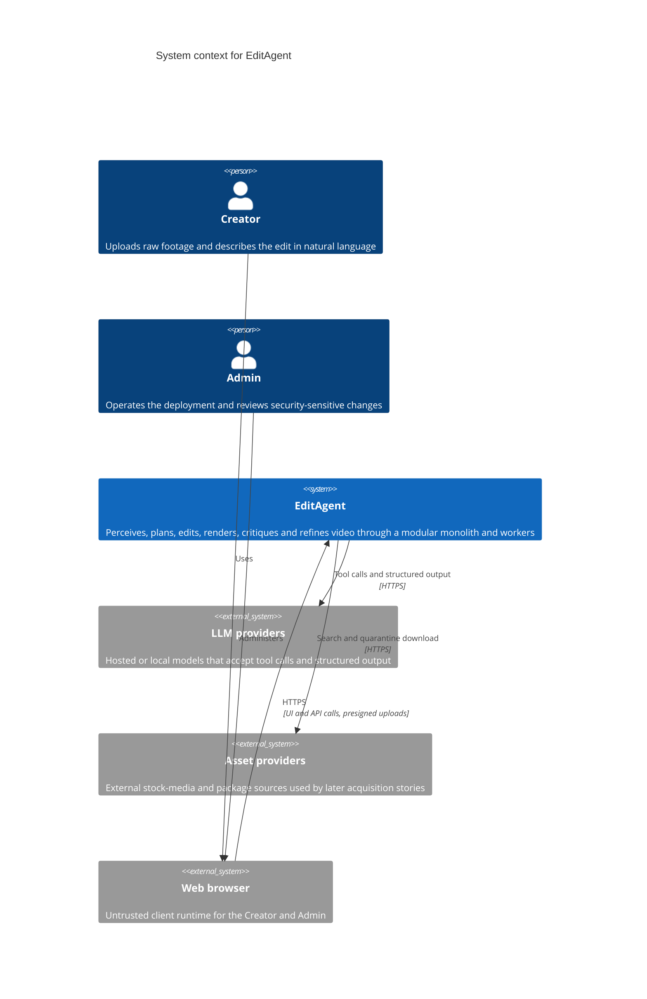
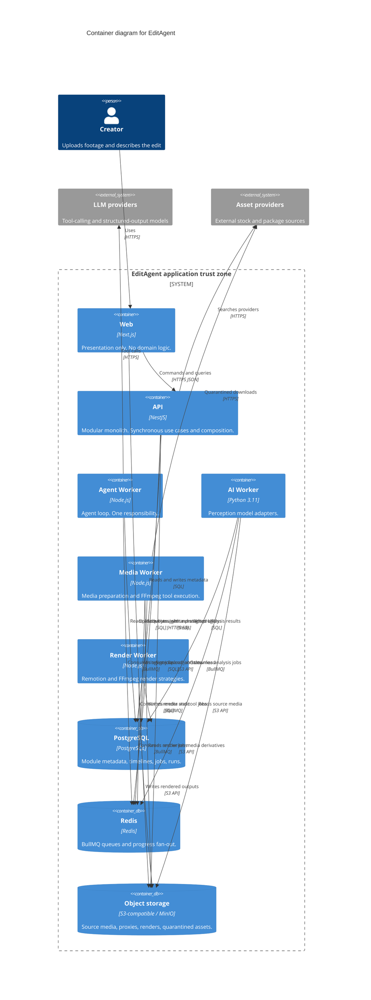

# EditAgent architecture

Baseline for US-103. This directory is the architecture source of truth. The Agile roadmap remains the source of truth for scope and sequencing. These pages do not change the roadmap.

**Acceptance status.** The layer rules and the module map are written so they can be enforced (US-103 AC3). ADR-001 through ADR-008 are **Accepted**. The project team / product owner approved them on 2026-09-29 through PR #2, which satisfies US-103 AC2.

## Navigation

| Document                                       | What it decides                                                                    |
| ---------------------------------------------- | ---------------------------------------------------------------------------------- |
| [modules.md](modules.md)                       | Bounded-module responsibilities, public interfaces, and the story ownership matrix |
| [c4-context.md](c4-context.md)                 | System context diagram                                                             |
| [c4-container.md](c4-container.md)             | Container diagram, communication paths, trust boundaries                           |
| [layer-rules.md](layer-rules.md)               | Clean Architecture dependency direction and the enforced rule names                |
| [ports-and-adapters.md](ports-and-adapters.md) | Port catalogue. Contracts only; adapters are later stories                         |
| [adr/README.md](adr/README.md)                 | ADR index                                                                          |

## System architecture

EditAgent is a modular monolith plus workers (ADR-001).

The web application is presentation. The API is the synchronous face of the bounded modules: a controller calls an application use case, and the use case calls the domain. Workers perform one runtime job each and share the same module code and the same ports. They are processes, not extra modules.

```text
presentation → application → domain ← infrastructure
```

The domain defines ports. Infrastructure implements them. The composition root of each process wires the two and starts the process. The domain does not import frameworks, database clients, web frameworks, queue clients, or adapter packages.

TypeScript is the language of the API, the web app, and the Node workers. Python 3.11 is the language of the AI worker (ADR-002). Data that crosses a process or a language boundary is a JSON Schema document (ADR-003). Jobs move on Redis through a BullMQ adapter behind `IJobQueue` (ADR-004). Metadata lives in PostgreSQL. Bytes live in S3-compatible object storage, MinIO in development (ADR-005). Model vendors sit behind Agent ports (ADR-006). Media time is an integer number of microseconds, and frame positions are integer frame indexes (ADR-008). Work lands on `main` through short-lived branches (ADR-007).

This slice documents those decisions and enforces the dependency direction. It does not connect Redis, PostgreSQL, MinIO, an LLM, FFmpeg, or Remotion.

## Bounded modules

Twelve modules own the product. A module has one public interface and one directory under `packages/domain/src/modules/<name>/`. A module may import the shared kernel and its own files. It may not import another module. Cross-module behavior is an application use case.

| Module     | Owns                                                                                                |
| ---------- | --------------------------------------------------------------------------------------------------- |
| Identity   | Accounts, sessions, roles, and the allow/deny decision                                              |
| Projects   | The Project aggregate, membership, project settings, brand kit, and whole-system governance stories |
| Media      | Source assets, upload, validation, technical metadata, proxies, thumbnails, playback                |
| Analysis   | Perception results and the MediaAnalysis contract                                                   |
| Editing    | Timeline, clips, edit commands, undo/redo                                                           |
| Tools      | Tool manifests, validation, permissions, execution, the FFmpeg command builder                      |
| Agent      | Model ports, prompts, the agent loop, creative policy, the sandbox port                             |
| Rendering  | Render requests, strategies, profiles, render cache, render preview                                 |
| Assets     | Asset registry, fonts, search, acquisition, quarantine, licenses                                    |
| Components | Remotion component manifests, packs, and generated components                                       |
| Critic     | Quality checks, critiques, evaluation datasets and harnesses                                        |
| Jobs       | The job aggregate, the queue port, progress, and platform runtime stories                           |

Responsibilities that would otherwise overlap (silence ranges versus the cut versus the FFmpeg tool, caption component versus caption tool, object-storage keys versus the storage adapter) are assigned in [modules.md](modules.md). That assignment is normative.

## Module ownership

Every planned roadmap story has exactly one owning module. Look the story up in the matrix in [modules.md](modules.md). The rule column records which ownership rule fired:

- `capability` — the story changes that module's data or public interface
- `governance` — a whole-system agreement, owned by Projects
- `runtime` — build, deploy, observe, or execute the platform, owned by Jobs

The engineering lane on the story (BE, FE, OPS, and the others) is not the module.

## Module public interfaces

Other modules call the operations below. They do not read another module's internal types. The names are the contract; the implementations arrive with the stories that own them. The full list, including types, is in [modules.md](modules.md).

| Module     | Public operations                                                                                                                       |
| ---------- | --------------------------------------------------------------------------------------------------------------------------------------- |
| Identity   | `authenticate`, `establishSession`, `revokeSession`, `authorize`                                                                        |
| Projects   | `createProject`, `getProject`, `updateProject`, `deleteProject`, `listProjects`, `updateProjectSettings`, `getBrandKit`, `saveBrandKit` |
| Media      | `beginUpload`, `completeUpload`, `inspectMedia`, `validateMedia`, `createDerivedAssets`, `getPlayback`                                  |
| Analysis   | `startAnalysis`, `getAnalysis`, `getTranscript`, `getSpeechSegments`, `getScenes`, `getFaces`                                           |
| Editing    | `getTimeline`, `applyCommand`, `undo`, `redo`, `restoreVersion`                                                                         |
| Tools      | `registerTool`, `getTool`, `validateToolCall`, `executeTool`                                                                            |
| Agent      | `startRun`, `step`, `cancelRun`, `getRun`, `listEvents`, `renderPrompt`, `selectModel`                                                  |
| Rendering  | `requestRender`, `getRender`, `selectStrategy`                                                                                          |
| Assets     | `registerAsset`, `searchAssets`, `getAsset`, `quarantineAcquisition`, `promoteAsset`                                                    |
| Components | `registerComponent`, `resolveComponent`, `recordGeneratedComponent`                                                                     |
| Critic     | `reviewRender`, `requestRefinement`, `recordEvaluation`                                                                                 |
| Jobs       | `enqueue`, `getJob`, `transition`, `publishProgress`, `subscribeProgress`                                                               |

## Layer dependency rules

The enforceable rules, with the dependency-cruiser and import-linter names, are in [layer-rules.md](layer-rules.md). The direction, in short:

- Presentation may depend on application and domain.
- Application may depend on domain.
- Infrastructure may depend on domain, because it implements domain ports.
- Domain may not depend on application, presentation, infrastructure, NestJS, Next.js, React, Express, BullMQ, an ORM, Remotion, or any other npm package.
- Domain modules may not depend on each other.
- The web app may depend on `packages/schemas` and `packages/shared`. It may not depend on `packages/domain` or on a worker.
- The API may depend on domain, schemas, and shared. It may not depend on workers or on `packages/media-core`.
- Workers may not depend on apps or on each other.

`packages/media-core` is an infrastructure adapter package. Domain code that imports it fails `domain-no-infrastructure`.

## Ports and adapters

Ports are inner interfaces. Adapters are outer implementations. The catalogue covers `IObjectStorage`, `IJobQueue`, the repository ports, `IChatModel` and the other model ports, the perception ports, `IMediaProbe` / `IMediaCommandBuilder` / `IMediaProcessor`, `IRenderStrategy`, and the future `ISandbox` and `IAssetProvider` ports. See [ports-and-adapters.md](ports-and-adapters.md).

Recording a port here does not implement it. Redis, PostgreSQL, MinIO, LLM SDKs, FFmpeg, and Remotion are not wired in this slice.

## Worker responsibilities

| Process       | Runtime     | Responsibility                                                             | Modules it hosts                                    |
| ------------- | ----------- | -------------------------------------------------------------------------- | --------------------------------------------------- |
| Web           | Next.js     | Render the UI and call the API.                                            | None. Presentation of several modules.              |
| API           | NestJS      | Authenticate later, run synchronous use cases, enqueue jobs, sign uploads. | Composition for the modular monolith.               |
| Agent worker  | Node.js     | Run the agent loop.                                                        | Agent                                               |
| AI worker     | Python 3.11 | Run perception adapters.                                                   | Analysis                                            |
| Media worker  | Node.js     | Prepare media and execute FFmpeg tools.                                    | Media and Tools, as separate modules in one process |
| Render worker | Node.js     | Run render strategies.                                                     | Rendering, loading Components manifests             |

The browser never calls a worker directly. Workers take jobs from the queue and write results through ports.

## C4 context



Source and actor notes: [c4-context.md](c4-context.md).

## C4 container



Communication paths and the five trust boundaries (browser, application zone, data stores, external providers, future sandbox) are specified in [c4-container.md](c4-container.md).

## ADR index

| ADR                                                 | Title                                                               | Status   | Date       |
| --------------------------------------------------- | ------------------------------------------------------------------- | -------- | ---------- |
| [ADR-001](adr/001-modular-monolith-plus-workers.md) | Modular monolith plus workers                                       | Accepted | 2026-09-29 |
| [ADR-002](adr/002-typescript-and-python.md)         | TypeScript for API, Web, and Node workers; Python for the AI worker | Accepted | 2026-09-29 |
| [ADR-003](adr/003-json-schema-contract.md)          | JSON Schema as the cross-language contract                          | Accepted | 2026-09-29 |
| [ADR-004](adr/004-redis-bullmq.md)                  | Redis and BullMQ                                                    | Accepted | 2026-09-29 |
| [ADR-005](adr/005-postgresql-and-s3.md)             | PostgreSQL and S3-compatible object storage                         | Accepted | 2026-09-29 |
| [ADR-006](adr/006-llm-provider-abstraction.md)      | LLM provider abstraction                                            | Accepted | 2026-09-29 |
| [ADR-007](adr/007-trunk-based-development.md)       | Trunk-based development with short-lived branches                   | Accepted | 2026-09-29 |
| [ADR-008](adr/008-integer-time.md)                  | Time representation as integer microseconds and frames              | Accepted | 2026-09-29 |

Full records: [adr/README.md](adr/README.md).
