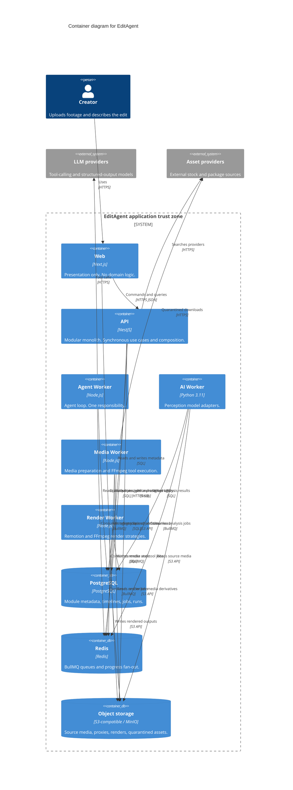

# C4 container

The diagram source is Mermaid and is stored in Git. [Architecture overview](README.md) repeats this diagram.

Containers inside the EditAgent boundary share one product and one set of module rules. They are not independently deployed microservices with private databases. PostgreSQL, Redis, and object storage are platform containers. LLM providers and asset providers are outside the boundary.

## Communication paths

| Path                                 | Protocol       | What crosses                            | Trust note                                                                            |
| ------------------------------------ | -------------- | --------------------------------------- | ------------------------------------------------------------------------------------- |
| Creator → Web                        | HTTPS          | UI actions                              | The browser is outside the application trust zone.                                    |
| Web → API                            | HTTPS JSON     | Commands and queries                    | The API authenticates the caller. The web process holds no database credentials.      |
| Web → object storage                 | HTTPS S3       | File bytes via a presigned URL          | The browser never receives storage credentials. The URL is scoped and time-limited.   |
| API → PostgreSQL                     | SQL            | Module metadata                         | Credentials stay in the API and worker processes.                                     |
| API → Redis                          | Redis / BullMQ | Job messages and progress               | Job payloads are schema-validated before a worker acts on them.                       |
| API → object storage                 | S3 API         | Signing and metadata                    | The API does not proxy large bodies.                                                  |
| Workers → Redis                      | BullMQ         | Job consumption and progress            | Workers do not accept traffic from the browser.                                       |
| Workers → PostgreSQL                 | SQL            | State for the modules that worker hosts | Shared database of the modular monolith, not a private database per worker.           |
| Workers → object storage             | S3 API         | Media, derivatives, renders             | Credentials are limited to the prefixes that worker owns.                             |
| Agent Worker → LLM providers         | HTTPS          | Prompts, tool schemas, model output     | External trust boundary. User text is untrusted. Provider secrets stay in the worker. |
| API / Media Worker → asset providers | HTTPS          | Search and download                     | External trust boundary. Downloads are untrusted until Assets quarantines them.       |
| Web → workers                        | none           | —                                       | The browser reaches workers only through the API and presigned URLs.                  |

## Trust boundaries

1. **Browser and public internet.** Untrusted. Identity authenticates every API call once that story exists. This slice does not implement authentication.
2. **Application trust zone.** Web, API, and the four workers. They may hold platform credentials. They accept work only from the API or the queue.
3. **Data stores.** PostgreSQL, Redis, and object storage. They are inside the deployment and outside the application code. Access is through ports (`IObjectStorage`, `IJobQueue`, repository ports).
4. **External providers.** LLM providers and asset providers. Their responses are untrusted input.
5. **Future sandbox.** Untrusted generated code will run outside this zone, through the `ISandbox` port owned by Agent. The sandbox is not implemented in this slice.

## What this diagram does not implement

Redis, BullMQ, PostgreSQL, MinIO, LLM clients, asset providers, and FFmpeg are drawn because they are part of the architecture. Their runtime wiring belongs to later stories (US-112 is not required here; US-114, US-120, US-122, US-126, US-129, and US-301 are explicitly deferred).
