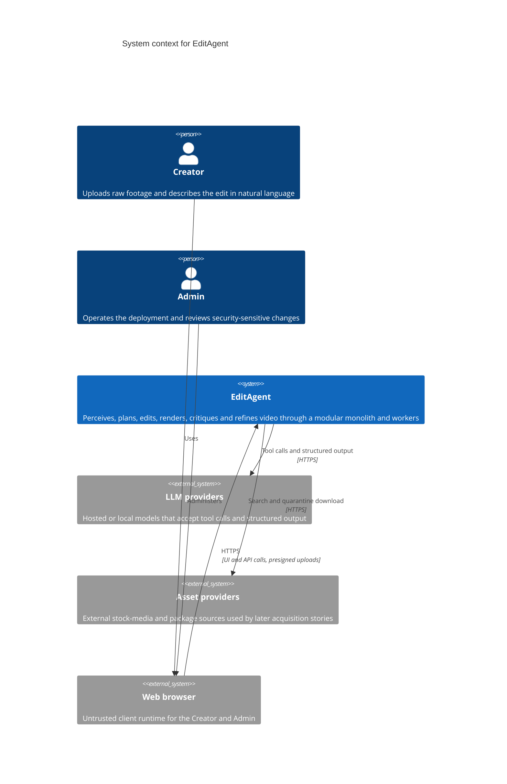

# C4 context

The diagram source is Mermaid and is stored in Git. [Architecture overview](README.md) repeats this diagram so the overview can be read on its own.

EditAgent is the system under design. People and external systems sit outside its trust boundary.

## Actors

| Actor | Relationship to EditAgent |
|---|---|
| Creator | Primary user. Uploads media, describes the result, reviews renders. |
| Admin | Operates the deployment and is the role that can perform administrative actions defined by Identity. |
| Web browser | Untrusted client. It is not part of the application trust zone. |
| LLM providers | External. Prompts are untrusted user content. Provider credentials stay in the application trust zone. |
| Asset providers | External. Nothing they return is trusted until a later Assets story quarantines and validates it. |

The AI agent is not a person. It is a secondary actor implemented inside EditAgent by the Agent module.
