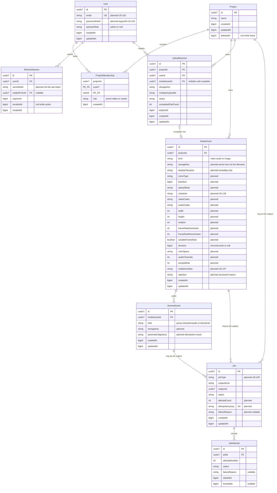
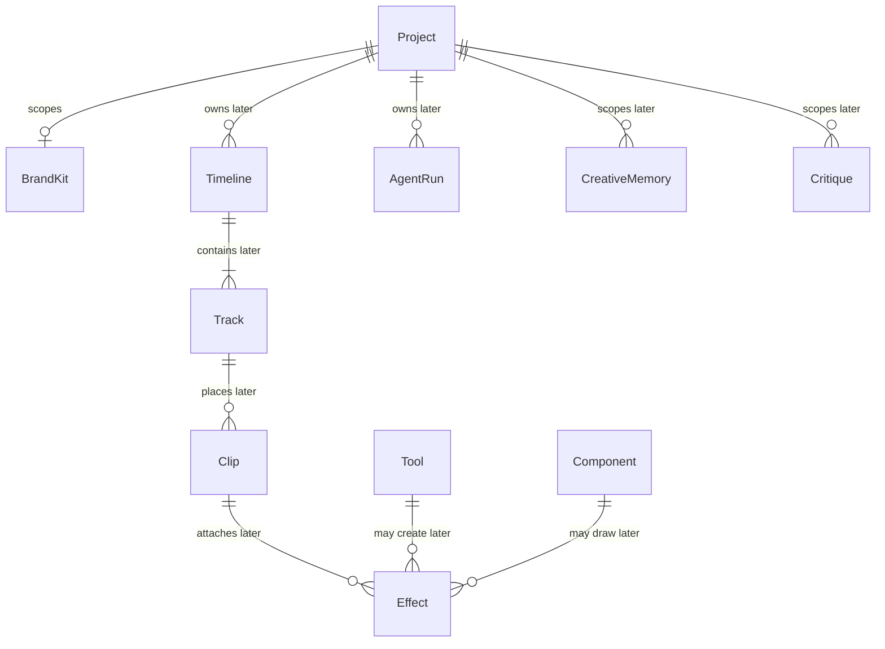

# Domain model and ER design

US-104 records the initial domain model. Persistence migrations are not in this document. US-120 owns the Project Postgres repository and its migrations. Later stories own the other adapters.

The domain package holds entities, value objects, invariants, and repository interfaces. It does not import an ORM, a database driver, or infrastructure. No ORM product is selected here. When a story adds a repository, the mapping lives in that story's infrastructure adapter and the domain interface stays free of column decorators.

Audit columns are wall-clock instants: integer Unix epoch milliseconds. They are not media time. Timeline positions and clip boundaries are integer microseconds (ADR-008). Identifiers are UUIDv7. The domain validates that version nibble. A UUID column in a later migration is a storage choice, not a domain type.

## What this slice implements

These aggregates have one repository interface each, in the owning module:

| Aggregate    | Repository               | Module   | Soft delete                               |
| ------------ | ------------------------ | -------- | ----------------------------------------- |
| User         | `UserRepository`         | Identity | No. Credential storage is US-118.         |
| Project      | `ProjectRepository`      | Projects | Yes. `deletedAt` set by `deleteProject`.  |
| MediaAsset   | `MediaAssetRepository`   | Media    | No in this slice.                         |
| DerivedAsset | `DerivedAssetRepository` | Media    | No. A DerivedAsset is not a MediaAsset.   |
| Job          | `JobRepository`          | Jobs     | No. The queue and transitions are US-129. |

`ProjectMembership` is an entity inside the Project aggregate, not a second aggregate and not a second repository. A normal listing excludes Projects whose `deletedAt` is set. There is no archive operation.

`Video`, `Audio`, and `Image` are subclasses of `MediaAsset`. The discriminator is `kind`. An unknown kind is rejected. A duration, when present, is an integer number of microseconds and must be <= 1,800,000,000.

A Job stores a `JobSubject` that names a Project, MediaAsset, or DerivedAsset identifier. It does not embed that aggregate. Jobs does not own the result.

Creating a Project takes the authenticated User id and records exactly one Owner membership in that operation. Membership roles are `owner`, `editor`, and `viewer`. Only an Owner grants or revokes membership. `grantMembership` checks the role at runtime. `admin` is an Identity operator role on `User`. It is not a membership role and it does not grant Project access.

`User.restore`, `Project.restore`, `MediaAsset.restore`, `DerivedAsset.restore`, and `Job.restore` rebuild a persisted snapshot. They validate identifiers, roles, kinds, durations, and timestamps. They do not replay `create`, membership commands, or deletion. Platform preset and target duration are future Project settings and are not part of this aggregate.

## Sprint 1 and Sprint 2 persistence plan

No migration is committed. Columns marked **planned** are the durable shape later stories will map. They are not fields on the domain classes in this pull request, except where a class already stores that fact (`kind`, `duration`, membership, soft delete, job status and subject).

Platform preset and target duration are future Project settings (later product stories). They are not implemented here.

`Video`, `Audio`, and `Image` are not separate tables. They are the `kind` discriminator on `MediaAsset`.

`RefreshSession` is the persisted refresh/rotation record for US-118. An access JWT is not stored. `secretHash` is the stored secret, not the token the browser holds. `revokedAt` and `rotatedFromId` are the revocation and rotation state. `expiresAt` is the session expiry.

`UploadSession` is the durable multipart/resumable upload for US-123. The storage key is server-generated. `displayFilename` on `MediaAsset` is metadata only and is never the key. `completedPartCount` is the progress that lets a reload resume. The S3 multipart API is not implemented here.

`JobAttempt` is the Postgres history US-129 asks for so the UI and audit can show attempts. This slice does not implement the state machine. US-130 progress fan-out is Redis pub/sub and does not add a table.

## Sprint 1 and Sprint 2 traceability

| Story                                 | Persistence                                                               |
| ------------------------------------- | ------------------------------------------------------------------------- |
| US-101 SRS                            | No application table.                                                     |
| US-102 Glossary and journeys          | No application table.                                                     |
| US-103 Architecture                   | No application table.                                                     |
| US-104 Domain model                   | This document. Classes and repository interfaces only.                    |
| US-105 ASR spike                      | No application table. Research record.                                    |
| US-106 Render spike                   | No application table. Research record.                                    |
| US-107 LLM spike                      | No application table. Research record.                                    |
| US-108 Risk and threat model          | No application table.                                                     |
| US-109 Backlog                        | No application table.                                                     |
| US-110 Evaluation dataset             | No product table. Licensed files and a manifest, not a runtime aggregate. |
| US-111 Monorepo                       | No application table.                                                     |
| US-112 CI                             | No application table.                                                     |
| US-113 Supply chain and image publish | No application table.                                                     |
| US-114 Compose                        | No application table.                                                     |
| US-115 Logging and health             | No application table. Logs are not these rows.                            |
| US-116 Test harness                   | No application table.                                                     |
| US-117 Walking-skeleton E2E           | No new table. Uses Project and MediaAsset once those stories exist.       |
| US-118 Authentication                 | `User.email`, `User.passwordHash`, and `RefreshSession`.                  |
| US-119 Web sign-in                    | Reuses `User` and `RefreshSession`.                                       |
| US-120 Project CRUD                   | `Project` and `ProjectMembership`.                                        |
| US-121 Dashboard                      | Reuses `Project`.                                                         |
| US-122 Direct upload                  | `MediaAsset` storage key, display filename, MIME, size, upload state.     |
| US-123 Resumable upload               | `UploadSession`.                                                          |
| US-124 Upload page                    | Reuses `MediaAsset`.                                                      |
| US-125 Media library                  | Reuses `MediaAsset` and `DerivedAsset`.                                   |
| US-126 Technical metadata             | Planned columns on `MediaAsset`.                                          |
| US-127 Validation                     | `MediaAsset.validationState` and `rejection`.                             |
| US-128 Proxies and thumbnails         | `DerivedAsset` storage key and parameter signature.                       |
| US-129 Job queue and history          | `Job` and `JobAttempt`.                                                   |
| US-130 Live progress                  | No table. Redis pub/sub.                                                  |
| US-131 Progress UI                    | Reuses `Job` and `JobAttempt`.                                            |

## Canonical names reserved for later stories

US-102 requires these spellings as domain class names. The classes exist so the glossary is not renamed. Their behavior and tables arrive with the stories that own them. This slice does not add repositories or migrations for them.

`Clip` in-point and out-point are integer microseconds. A float is rejected by the time kernel.

## Repository boundary

| Port                     | Defined in                              | Adapter story |
| ------------------------ | --------------------------------------- | ------------- |
| `UserRepository`         | `packages/domain/src/modules/identity/` | US-118        |
| `ProjectRepository`      | `packages/domain/src/modules/projects/` | US-120        |
| `MediaAssetRepository`   | `packages/domain/src/modules/media/`    | US-122        |
| `DerivedAssetRepository` | `packages/domain/src/modules/media/`    | US-128        |
| `JobRepository`          | `packages/domain/src/modules/jobs/`     | US-129        |

`IJobQueue` remains the queue port from the ports catalogue. It is not the Job repository. `IObjectStorage` remains the byte port. Neither is implemented here.
