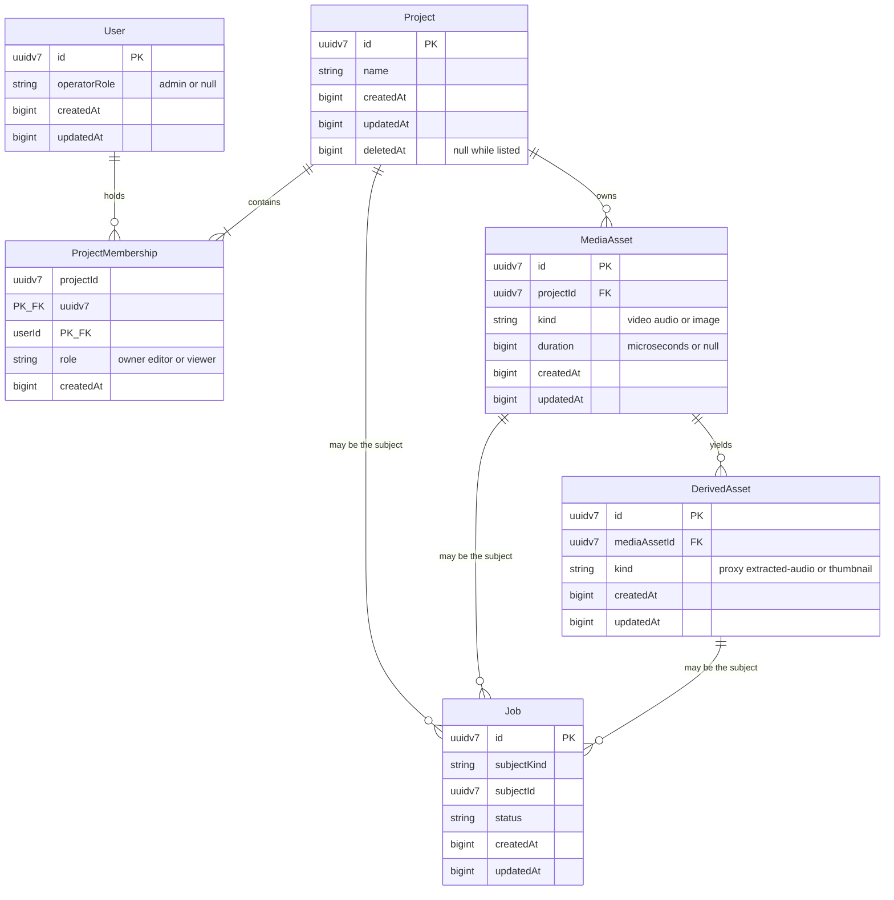
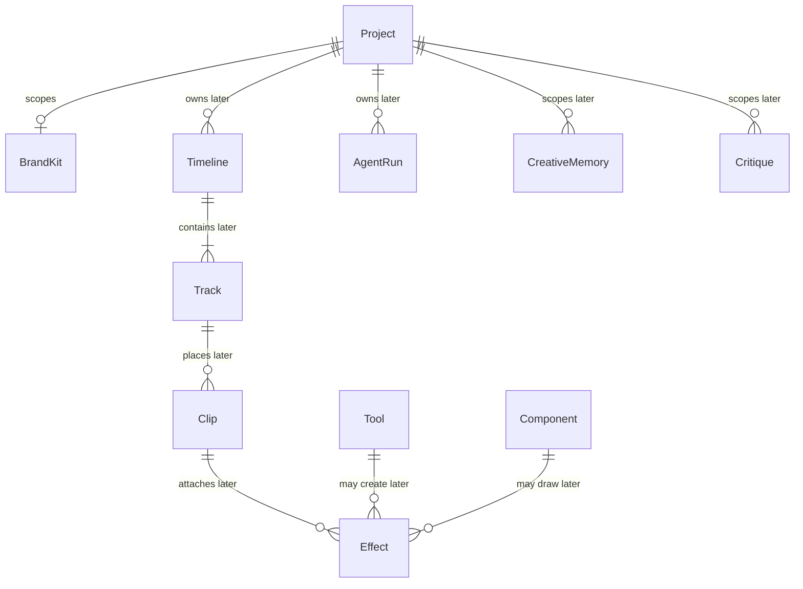

# Domain model and ER design

US-104 records the initial domain model. Persistence migrations are not in this document. US-120 owns the Project Postgres repository and its migrations. Later stories own the other adapters.

The domain package holds entities, value objects, invariants, and repository interfaces. It does not import an ORM, a database driver, or infrastructure. No ORM product is selected here. When a story adds a repository, the mapping lives in that story's infrastructure adapter and the domain interface stays free of column decorators.

Audit columns are wall-clock instants: integer Unix epoch milliseconds. They are not media time. Timeline positions and clip boundaries are integer microseconds (ADR-008). Identifiers are UUIDv7. The domain validates that version nibble. A UUID column in a later migration is a storage choice, not a domain type.

## What this slice implements

These aggregates have one repository interface each, in the owning module:

| Aggregate    | Repository               | Module   | Soft delete                               |
| ------------ | ------------------------ | -------- | ----------------------------------------- |
| User         | `UserRepository`         | Identity | No. Credential storage is US-118.         |
| Project      | `ProjectRepository`      | Projects | Yes. `deletedAt` set by `deleteProject`.  |
| MediaAsset   | `MediaAssetRepository`   | Media    | No in this slice.                         |
| DerivedAsset | `DerivedAssetRepository` | Media    | No. A DerivedAsset is not a MediaAsset.   |
| Job          | `JobRepository`          | Jobs     | No. The queue and transitions are US-129. |

`ProjectMembership` is an entity inside the Project aggregate, not a second aggregate and not a second repository. A normal listing excludes Projects whose `deletedAt` is set. There is no archive operation.

`Video`, `Audio`, and `Image` are subclasses of `MediaAsset`. The discriminator is `kind`. An unknown kind is rejected. A duration, when present, is an integer number of microseconds and must be <= 1,800,000,000.

A Job stores a `JobSubject` that names a Project, MediaAsset, or DerivedAsset identifier. It does not embed that aggregate. Jobs does not own the result.

Creating a Project takes the authenticated User id and records exactly one Owner membership in that operation. Membership roles are `owner`, `editor`, and `viewer`. Only an Owner grants or revokes membership. `admin` is an Identity operator role on `User`. It is not a membership role and it does not grant Project access.

## Sprint 1 and Sprint 2 entities

Implemented in this slice, and intended as later tables. No migration is committed.

`Video`, `Audio`, and `Image` are not separate tables in this design. They are the `kind` discriminator on `MediaAsset`.

Sprint 2 also needs a session for US-118 and an upload session for US-122 and US-123. Those tables are not implemented in this slice and have no repository here:

| Future table  | Story          | Why it is not a class yet                          |
| ------------- | -------------- | -------------------------------------------------- |
| Session       | US-118         | Authentication is not this story.                  |
| UploadSession | US-122, US-123 | Presigned and resumable upload are not this story. |

## Canonical names reserved for later stories

US-102 requires these spellings as domain class names. The classes exist so the glossary is not renamed. Their behavior and tables arrive with the stories that own them. This slice does not add repositories or migrations for them.

`Clip` in-point and out-point are integer microseconds. A float is rejected by the time kernel.

## Repository boundary

| Port                     | Defined in                              | Adapter story |
| ------------------------ | --------------------------------------- | ------------- |
| `UserRepository`         | `packages/domain/src/modules/identity/` | US-118        |
| `ProjectRepository`      | `packages/domain/src/modules/projects/` | US-120        |
| `MediaAssetRepository`   | `packages/domain/src/modules/media/`    | US-122        |
| `DerivedAssetRepository` | `packages/domain/src/modules/media/`    | US-128        |
| `JobRepository`          | `packages/domain/src/modules/jobs/`     | US-129        |

`IJobQueue` remains the queue port from the ports catalogue. It is not the Job repository. `IObjectStorage` remains the byte port. Neither is implemented here.
