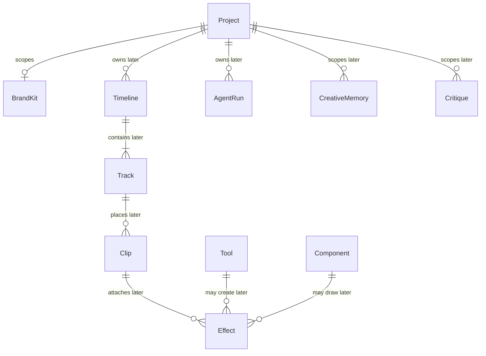

# Domain model and ER design

US-104 records the initial domain model. US-120 adds the Project and ProjectMembership migration in `apps/api/migrations`. US-118 adds `users`, `refresh_sessions`, and the `project_memberships.user_id` foreign key in `0007_identity.sql`. Later stories own the other adapters.

The domain package holds entities, value objects, invariants, and repository interfaces. It does not import an ORM, a database driver, or infrastructure. No ORM product is selected here. When a story adds a repository, the mapping lives in that story's infrastructure adapter and the domain interface stays free of column decorators.

Audit columns are wall-clock instants: integer Unix epoch milliseconds. They are not media time. Timeline positions and clip boundaries are integer microseconds (ADR-008). Identifiers are UUIDv7. The domain validates that version nibble. A UUID column in a later migration is a storage choice, not a domain type.

`Project.updatedAt` is that audit instant. The Project table also stores `revision`, a persistence concurrency token that increments on every successful write. It is not wall-clock time, media time, or a field on the Project aggregate. HTTP responses do not include it.

US-122 migrates the MediaAsset upload columns: storage key, display filename, MIME type, byte size, SHA-256, and upload state `uploaded`. The storage key is `projects/<projectId>/media/sha256/<sha256>`. The display filename is metadata and is not part of that key. US-126 adds inspection columns in `0003_media_probe_metadata.sql`. Duration stays null after upload and is set, in integer microseconds, only when inspection succeeds. Inspection status is `pending`, `completed`, or `failed`. It is not the US-127 validation state. `0004_media_inspection_revision.sql` adds `inspection_revision`, a persistence concurrency token that starts at zero and increments on each successful inspection write. It is not media time, not `updated_at`, and not a field on the MediaAsset aggregate. HTTP responses do not include it.

## What this slice implements

These aggregates have one repository interface each, in the owning module:

| Aggregate    | Repository               | Module   | Soft delete                               |
| ------------ | ------------------------ | -------- | ----------------------------------------- |
| User         | `UserRepository`         | Identity | No. Credentials are argon2id hashes.      |
| Project      | `ProjectRepository`      | Projects | Yes. `deletedAt` set by `deleteProject`.  |
| MediaAsset   | `MediaAssetRepository`   | Media    | No in this slice.                         |
| DerivedAsset | `DerivedAssetRepository` | Media    | No. A DerivedAsset is not a MediaAsset.   |
| Job          | `JobRepository`          | Jobs     | No. The queue and transitions are US-129. |

`ProjectMembership` is an entity inside the Project aggregate, not a second aggregate and not a second repository. A normal listing excludes Projects whose `deletedAt` is set. There is no archive operation.

`Video`, `Audio`, and `Image` are subclasses of `MediaAsset`. The discriminator is `kind`. An unknown kind is rejected. A duration, when present, is an integer number of microseconds and must be <= 1,800,000,000.

A Job stores a `JobSubject` that names a Project, MediaAsset, or DerivedAsset identifier. It does not embed that aggregate. Jobs does not own the result.

Creating a Project takes the authenticated User id and records exactly one Owner membership in that operation. Membership roles are `owner`, `editor`, and `viewer`. Only an Owner grants or revokes membership. `grantMembership` checks the role at runtime. `admin` is an Identity operator role on `User`. It is not a membership role and it does not grant Project access.

`User.restore`, `Project.restore`, `MediaAsset.restore`, `DerivedAsset.restore`, and `Job.restore` rebuild a persisted snapshot. They validate identifiers, roles, kinds, durations, and timestamps. They do not replay `create`, membership commands, or deletion. Platform preset and target duration are future Project settings and are not part of this aggregate.

## Sprint 1 and Sprint 2 persistence plan

Project and ProjectMembership are migrated by US-120. Columns marked **planned** are the durable shape later stories will map. They are not fields on the domain classes in this pull request, except where a class already stores that fact (`kind`, `duration`, membership, soft delete, job status and subject).

Platform preset and target duration are future Project settings (later product stories). They are not implemented here.

```mermaid
erDiagram
  User ||--o{ ProjectMembership : "holds"
  User ||--o{ RefreshSession : "rotates"
  Project ||--|{ ProjectMembership : "contains"
  Project ||--o{ MediaAsset : "owns"
  Project ||--o{ UploadSession : "starts"
  User ||--o{ UploadSession : "initiates"
  UploadSession |o--o| MediaAsset : "completes into"
  UploadSession ||--o{ UploadPart : "records"
  MediaAsset ||--o{ DerivedAsset : "yields"
  Project ||--o{ Job : "may be the subject"
  MediaAsset ||--o{ Job : "may be the subject"
  DerivedAsset ||--o{ Job : "may be the subject"
  Job ||--o{ JobAttempt : "records"

  User {
    uuidv7 id PK
    string email UK
    string passwordHash "argon2id"
    string operatorRole "admin or null"
    bigint createdAt
    bigint updatedAt
  }

  RefreshSession {
    uuidv7 id PK
    uuidv7 userId FK
    string secretHash "not the raw token"
    uuidv7 rotatedFromId FK "nullable"
    bigint expiresAt
    bigint revokedAt "null while active"
    bigint createdAt
  }

  Project {
    uuidv7 id PK
    string name
    bigint createdAt
    bigint updatedAt
    bigint deletedAt "null while listed"
    bigint revision "persistence token, not audit time"
  }

  ProjectMembership {
    uuidv7 projectId PK_FK
    uuidv7 userId PK_FK
    string role "owner editor or viewer"
    bigint createdAt
  }

  MediaAsset {
    uuidv7 id PK
    uuidv7 projectId FK
    string kind "video audio or image"
    string storageKey "planned server key not the filename"
    string displayFilename "planned metadata only"
    string mimeType "planned"
    bigint byteSize "planned"
    string uploadState "planned"
    string container "null until inspection"
    string videoCodec "null when unknown"
    string audioCodec "null when unknown"
    int width "stored width"
    int height "stored height"
    int displayWidth "rotation-oriented"
    int displayHeight "rotation-oriented"
    int rotation "0 90 180 270 or null"
    bigint frameRateNumerator "null when unknown"
    bigint frameRateDenominator "null when unknown"
    string frameRateMode "constant variable unknown or null"
    bigint duration "microseconds or null"
    string colorSpace "null when unreported"
    int audioChannels "null when unreported"
    int sampleRate "null when unreported"
    jsonb streams "video and audio streams or null"
    string inspectionStatus "pending completed or failed"
    string inspectionError "safe code or null"
    bigint inspectionRevision "persistence token, not audit time"
    string validationState "planned US-127"
    string rejection "planned structured reason"
    bigint createdAt
    bigint updatedAt
  }

  UploadSession {
    uuidv7 id PK
    uuidv7 projectId FK
    uuidv7 userId FK
    uuidv7 mediaAssetId FK "nullable until complete"
    string storageKey
    string multipartUploadId
    string status
    int completedPartCount "derived cache only, not the source of truth"
    bigint expiresAt
    bigint createdAt
    bigint updatedAt
  }

  UploadPart {
    uuidv7 uploadSessionId PK_FK
    int partNumber PK
    string etag
    bigint byteSize
    string checksum "nullable provider checksum"
    bigint completedAt
  }

  DerivedAsset {
    uuidv7 id PK
    uuidv7 mediaAssetId FK
    string kind "proxy extracted-audio or thumbnail"
    string storageKey "planned"
    string parameterSignature "planned idempotent reuse"
    bigint createdAt
    bigint updatedAt
  }

  Job {
    uuidv7 id PK
    string queueName
    string jobType
    string idempotencyKey UK
    string status
    string subjectKind
    uuidv7 subjectId
    json payload
    int timeoutMs
    int maxAttempts
    int attemptCount
    string failureReason "nullable"
    bigint createdAt
    bigint updatedAt
  }

  JobAttempt {
    uuidv7 id PK
    uuidv7 jobId FK
    int attemptNumber
    string status
    string reason "nullable"
    bigint startedAt
    bigint finishedAt "nullable"
  }

  JobDeadLetter {
    uuidv7 jobId PK_FK
    string reason
    json envelope
    bigint createdAt
  }
```

`Video`, `Audio`, and `Image` are not separate tables. They are the `kind` discriminator on `MediaAsset`.

`RefreshSession` is the persisted refresh/rotation record for US-118. An access JWT is not stored. `secretHash` is the stored secret, not the token the browser holds. `revokedAt` and `rotatedFromId` are the revocation and rotation state. `expiresAt` is the session expiry. Consuming a refresh token revokes that row and inserts its replacement in one transaction, so one presented token cannot create two active sessions. A wrong password increments `failed_login_count` with one conditional update.

`UploadSession` stores the overall multipart upload for US-123: who started it, the server storage key, the provider upload id, status, and expiry. `UploadPart` stores each successful part. The key is `(uploadSessionId, partNumber)`. `etag` is what completion must send back, in part-number order. A failed part is simply absent, so parts 1, 2, and 4 can be stored while part 3 is not. A reload reads those rows and does not resend them. `completedPartCount` may be cached for display. It is not the source of truth. The S3 multipart API is not implemented here.

`Job`, `JobAttempt`, and `JobDeadLetter` are the Postgres history for US-129. Redis holds the BullMQ message. These rows are the record that survives a Redis flush. `0005_jobs.sql` creates them. US-130 progress fan-out is Redis pub/sub and does not add a table.

`inspect_publication_outbox` in `0006_inspect_publication_outbox.sql` is the durable intent to publish one `media.inspect` job for an uploaded MediaAsset. The asset row and the intent commit in one transaction, so a stored asset is not left without a recoverable publication. A dispatcher leases due rows with `FOR UPDATE SKIP LOCKED` and delivers them through the existing `publishMediaInspectJob` path. Delivery is at-least-once. A crash after Redis accepts the message is recovered by republishing the same job id, which the job idempotency key already treats as one logical job. The row is marked delivered only after that publication returns, or when that job is already terminal. Transient failures stay pending with bounded backoff and an error history.

## Sprint 1 and Sprint 2 traceability

| Story                                 | Persistence                                                                                                                      |
| ------------------------------------- | -------------------------------------------------------------------------------------------------------------------------------- |
| US-101 SRS                            | No application table.                                                                                                            |
| US-102 Glossary and journeys          | No application table.                                                                                                            |
| US-103 Architecture                   | No application table.                                                                                                            |
| US-104 Domain model                   | This document. Classes and repository interfaces only.                                                                           |
| US-105 ASR spike                      | No application table. Research record.                                                                                           |
| US-106 Render spike                   | No application table. Research record.                                                                                           |
| US-107 LLM spike                      | No application table. Research record.                                                                                           |
| US-108 Risk and threat model          | No application table.                                                                                                            |
| US-109 Backlog                        | No application table.                                                                                                            |
| US-110 Evaluation dataset             | No product table. Licensed files and a manifest, not a runtime aggregate.                                                        |
| US-111 Monorepo                       | No application table.                                                                                                            |
| US-112 CI                             | No application table.                                                                                                            |
| US-113 Supply chain and image publish | No application table.                                                                                                            |
| US-114 Compose                        | No application table.                                                                                                            |
| US-115 Logging and health             | No application table. Logs are not these rows.                                                                                   |
| US-116 Test harness                   | No application table.                                                                                                            |
| US-117 Walking-skeleton E2E           | No new table. Uses Project and MediaAsset once those stories exist.                                                              |
| US-118 Authentication                 | `User.email`, `User.passwordHash`, and `RefreshSession`.                                                                         |
| US-119 Web sign-in                    | Reuses `User` and `RefreshSession`.                                                                                              |
| US-120 Project CRUD                   | `Project` and `ProjectMembership`.                                                                                               |
| US-121 Dashboard                      | Reuses `Project`.                                                                                                                |
| US-122 Direct upload                  | `MediaAsset` storage key, display filename, MIME, size, upload state.                                                            |
| US-123 Resumable upload               | `UploadSession` for the upload, `UploadPart` for each completed part number and ETag.                                            |
| US-124 Upload page                    | Reuses `MediaAsset`.                                                                                                             |
| US-125 Media library                  | Reuses `MediaAsset` and `DerivedAsset`.                                                                                          |
| US-126 Technical metadata             | `media_assets` inspection columns in `0003_media_probe_metadata.sql`. Duration is integer microseconds after a successful probe. |
| US-127 Validation                     | `MediaAsset.validationState` and `rejection`.                                                                                    |
| US-128 Proxies and thumbnails         | `DerivedAsset` storage key and parameter signature.                                                                              |
| US-129 Job queue and history          | `jobs`, `job_attempts`, and `job_dead_letters` in `0005_jobs.sql`. Redis is the broker, not the record.                          |
| US-130 Live progress                  | No table. Redis pub/sub.                                                                                                         |
| US-131 Progress UI                    | Reuses `Job` and `JobAttempt`.                                                                                                   |

## Canonical names reserved for later stories

US-102 requires these spellings as domain class names. The classes exist so the glossary is not renamed. Their behavior and tables arrive with the stories that own them. This slice does not add repositories or migrations for them.



`Clip` in-point and out-point are integer microseconds. A float is rejected by the time kernel.

## Repository boundary

| Port                     | Defined in                              | Adapter story |
| ------------------------ | --------------------------------------- | ------------- |
| `UserRepository`         | `packages/domain/src/modules/identity/` | US-118        |
| `ProjectRepository`      | `packages/domain/src/modules/projects/` | US-120        |
| `MediaAssetRepository`   | `packages/domain/src/modules/media/`    | US-122        |
| `DerivedAssetRepository` | `packages/domain/src/modules/media/`    | US-128        |
| `JobRepository`          | `packages/domain/src/modules/jobs/`     | US-129        |

`IJobQueue` remains the queue port from the ports catalogue. It is not the Job repository. US-129 implements it as `BullMqJobQueue` in the media worker and as the BullMQ Python client in the AI worker. `IObjectStorage` remains the byte port.
