# Use case diagram

Canonical diagram for US-102. The use-case catalogue is [docs/requirements/use-cases.md](../requirements/use-cases.md).

Creator, Admin, and Viewer are people. The AI Agent is a secondary actor implemented inside EditAgent. External Asset Providers sit outside the trust boundary (ADR-001, ADR-005).

```mermaid
flowchart TB
  creator["Creator"]
  admin["Admin"]
  viewer["Viewer"]
  agent["AI Agent"]
  providers["External Asset Providers"]

  subgraph editagent ["EditAgent"]
    uc01["UC-01 Sign in"]
    uc02["UC-02 Manage membership and roles"]
    uc03["UC-03 Create and configure a Project"]
    uc04["UC-04 Upload and validate a MediaAsset"]
    uc05["UC-05 Inspect media and play a proxy"]
    uc06["UC-06 Analyse a MediaAsset"]
    uc07["UC-07 Edit the Timeline"]
    uc08["UC-08 Produce a short-form edit"]
    uc09["UC-09 Render and download"]
    uc10["UC-10 Review and refine"]
    uc11["UC-11 Revise in natural language"]
    uc12["UC-12 Insert a local asset"]
    uc13["UC-13 Acquire an external resource"]
    uc14["UC-14 Generate a Component"]
    uc15["UC-15 Administer the deployment"]
    uc16["UC-16 Apply a BrandKit"]
  end

  creator --> uc01
  creator --> uc03
  creator --> uc04
  creator --> uc05
  creator --> uc07
  creator --> uc08
  creator --> uc09
  creator --> uc11
  creator --> uc12
  admin --> uc01
  admin --> uc02
  admin --> uc15
  viewer --> uc01
  viewer --> uc05
  viewer --> uc09
  agent -.-> uc06
  agent -.-> uc08
  agent -.-> uc10
  agent -.-> uc11
  agent -.-> uc12
  agent -.-> uc13
  agent -.-> uc14
  agent -.-> uc16
  providers -.-> uc13
```

Solid arrows are primary actors. Dotted arrows are the AI Agent or an external system. The AI Agent does not authenticate as a person and does not receive storage credentials.

The Mermaid block above is the source. [use-case-diagram.svg](use-case-diagram.svg) is an export of that block, produced with `@mermaid-js/mermaid-cli` 11.4.2. If the two differ, the Mermaid source wins. Regenerate the SVG from the fenced block rather than editing the image.
