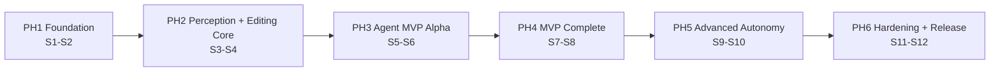

# EditAgent - Agile Execution Roadmap

This roadmap restructures the *EditAgent Graduation Project Execution and Engineering Plan* (24 weeks, 4-6 people) into
**Phases -> Epics -> Features -> User Stories -> Technical Tasks**, scheduled into **12 two-week Sprints**. Each sprint
ends with a working, tested increment on staging. The MVP comes first (Sprints 1-8) and advanced autonomy follows
(Sprints 9-10). Hardening and release (Sprints 11-12) finish work that was running from the start: testing, security,
documentation and CI/CD are tasks inside each story from Sprint 1, not a late phase.

| Document | Contents |
|---|---|
| [Phase 1 - Foundation and Walking Skeleton](phases/phase-1-foundation.md) | Sprints 1-2 - requirements, architecture, platform, auth, ingestion, jobs |
| [Phase 2 - Perception Engine and Editing Core](phases/phase-2-perception-editing-core.md) | Sprints 3-4 - speech/audio/visual perception, MediaAnalysis, timeline, render engine, Tool SDK |
| [Phase 3 - Autonomous Editor Agent - MVP Alpha](phases/phase-3-agent-mvp-alpha.md) | Sprints 5-6 - LLM layer, agent loop, core tools, first autonomous reel |
| [Phase 4 - MVP Completion](phases/phase-4-mvp-complete.md) | Sprints 7-8 - components, fonts, assets and B-roll, chat edits, self-review, hardening |
| [Phase 5 - Advanced Autonomy](phases/phase-5-advanced-autonomy.md) | Sprints 9-10 - sandbox, code generation, internet acquisition, critic, creative intelligence |
| [Phase 6 - Hardening, Evaluation and Release](phases/phase-6-hardening-release.md) | Sprints 11-12 - security, performance, observability, evaluation, docs, v1.0-graduation |
| [Sprint plan](sprints.md) | Sprint goals, increments, deliverables, committed stories, parallel lanes, quality work per sprint |
| [Dependency map](dependencies.md) | Phase and epic graphs, epic parallelism, critical path, full story dependency register |
| [Milestones and checkpoints](milestones.md) | Exit criteria and fallbacks for M0-M7 and CP1-CP6 |
| [export/jira-import.csv](export/jira-import.csv) | Legacy generated export. Jira is not the active tracker |
| [export/backlog-full.csv](export/backlog-full.csv) | Every level (Phase, Epic, Feature, Story, Task) with parents, sprint, lane, points, dependencies |

Each phase document follows the same ten sections: Objective, Epics, Features, User Stories, Technical Tasks,
Acceptance Criteria, Dependencies, Sprint allocation, Deliverables and Definition of Done.

---

## 1. Planning assumptions

| Parameter | Value |
|---|---|
| Duration | 24 weeks = 12 sprints x 2 weeks |
| Team | 5 engineers with lane ownership (AI/Agent, Multimedia, Generative Video/Remotion, Backend, Frontend) plus DevOps/QA as a shared lane (a sixth member takes it if available) |
| Estimation | Story points on the Fibonacci scale (1, 2, 3, 5, 8, 13); stories above 8 are split before they are Ready |
| Planning velocity | 48 SP per sprint, hard cap 52 SP (validated automatically). Sprint 12 is planned at about 32 SP to leave room for release defects and thesis writing |
| Priorities | P0 Must (MVP-critical), P1 Should, P2 Could (advanced), P3 Stretch. The stretch backlog is not committed to any sprint |
| Scope flex | Time and quality are fixed and scope flexes. With 4 people, drop the stretch backlog and move P2 items out of Sprints 9-10 first; with 6 people, pull stretch items in after Sprint 8 |

Lanes name the **primary owner**, not an exclusive silo. Pairing across lanes is expected, especially on the shared OPS
lane (heavy in Sprint 1) and on integration stories.

## 2. Roadmap at a glance

| Phase | Sprints | Weeks | Release | Scope | Milestones |
|---|---|---|---|---|---|
| PH1 Foundation and Walking Skeleton | 1-2 | 1-4 | v0.1 Ingest | MVP | M0, CP1, M1 |
| PH2 Perception Engine and Editing Core | 3-4 | 5-8 | v0.2 Understand and Cut | MVP | CP2, M2 |
| PH3 Autonomous Editor Agent - MVP Alpha | 5-6 | 9-12 | v0.3 MVP Alpha | MVP | CP3, **M3 first autonomous video** |
| PH4 MVP Completion | 7-8 | 13-16 | v0.9-mvp | MVP | CP4, **M4 MVP complete** |
| PH5 Advanced Autonomy | 9-10 | 17-20 | v0.95-beta | Advanced | CP5, **M5 feature freeze** |
| PH6 Hardening, Evaluation and Release | 11-12 | 21-24 | v1.0-graduation | Release | CP6, M6, **M7 graduation** |



Phases are **time-boxed release increments, not technical layers**. Inside each phase, all lanes work in parallel on
different epics, for example perception (AI, MM) alongside the timeline model (BE), the render worker (GEN) and the
analysis UI (FE) in Phase 2. The generated [lane x sprint matrix](sprints.md#parallel-workstreams-at-a-glance) shows
this in full.

### Why the order differs from the original plan

- **Job queue moved from weeks 20-21 to Sprint 2.** Transcription, analysis and rendering are asynchronous from their
  first version, so the queue is a prerequisite, not an optimization.
- **Timeline model, render worker and Tool SDK start in Sprints 3-4, alongside perception.** This removes the
  sequential hand-offs of original Phases 3, 4 and 5 and lets the agent start in Sprint 5 on a frozen SDK.
- **A deterministic "remove silences" edit ships in Sprint 4,** before any LLM work. It proves analysis, commands,
  tools and rendering end-to-end and de-risks milestone M3.
- **Security, observability, caching and testing are spread across sprints.** Hostile-media defence (S2), FFmpeg
  argument safety (S3), tool permissions (S4-S5), analysis caching (S7) and hardened containers (S8) all land before
  the risky Level-3 features in Sprints 9-10.
- **The web application is built in every sprint** (original Phase 13 ran weeks 15-21), so every increment can be
  demonstrated from the UI.

## 3. Traceability to the original plan

| Original plan section | Where it lives now |
|---|---|
| Phase 0 Requirements and Research | [EP-01](phases/phase-1-foundation.md#ep-01---product-discovery-and-architecture-baseline) (S1-S2) |
| Phase 1 Project Foundation | [EP-02](phases/phase-1-foundation.md#ep-02---engineering-platform-and-developer-experience) (S1-S2) |
| Phase 2 Multimedia Core | [EP-04](phases/phase-1-foundation.md#ep-04---media-ingestion-and-multimedia-core) (S1-S2) |
| Phase 3 AI Perception Engine | EP-06 to EP-09 (S3-S4); active speaker US-424 (S7); visual captions/object detection US-519 (stretch) |
| Phase 4 Editing Tool SDK | [EP-12](phases/phase-2-perception-editing-core.md#ep-12---editing-tool-sdk-and-media-operations) (S3-S4); MVP tools [EP-15](phases/phase-3-agent-mvp-alpha.md#ep-15---core-editing-tools) (S5-S6) |
| Phase 5 Editing Project Model | [EP-10](phases/phase-2-perception-editing-core.md#ep-10---editing-project-model) (S3); version history US-417 (S8) |
| Phase 6 AI Editor Agent V1 | [PH3](phases/phase-3-agent-mvp-alpha.md) EP-13, EP-14 (S5-S6) |
| Phase 7 Remotion Generative Engine | Render worker EP-11 (S3-S4); component library [EP-18](phases/phase-4-mvp-complete.md#ep-18---remotion-component-library-and-plugin-system) (S7-S8); generated components EP-25 (S9-S10) |
| Phase 8 Font and Design System | [EP-19](phases/phase-4-mvp-complete.md#ep-19---fonts-and-design-system) (S7); brand kits US-521, US-522 (S10) |
| Phase 9 Asset and Component Intelligence | Local registry [EP-20](phases/phase-4-mvp-complete.md#ep-20---asset-registry-and-basic-b-roll) (S7-S8); internet acquisition [EP-26](phases/phase-5-advanced-autonomy.md#ep-26---external-resource-acquisition) (S9-S10) |
| Phase 10 Autonomous Code Generation | Sandbox [EP-24](phases/phase-5-advanced-autonomy.md#ep-24---secure-execution-sandbox) and generation [EP-25](phases/phase-5-advanced-autonomy.md#ep-25---autonomous-component-generation) (S9-S10) |
| Phase 11 AI Critic and Self-Refinement | Critic v0 [EP-22](phases/phase-4-mvp-complete.md#ep-22---basic-self-review-critic-v0) (S8); critic v1 [EP-27](phases/phase-5-advanced-autonomy.md#ep-27---ai-critic-and-self-refinement) (S9-S10) |
| Phase 12 Creative Intelligence | Highlights US-307 (S6); [EP-28](phases/phase-5-advanced-autonomy.md#ep-28---creative-intelligence) (S9-S10) |
| Phase 13 Web Application | FE lane in every sprint - shell/auth/upload (S1-S2), player/transcript/analysis (S3-S4), wizard/run view (S5-S6), preview/fonts/chat (S7-S8), timeline/assets/brand/gallery/dashboard (S9-S10), run inspector (S11) |
| Phase 14 Job Processing and Scalability | [EP-05](phases/phase-1-foundation.md#ep-05---asynchronous-job-processing) (S2); parallel analysis DAG US-605 (S11) |
| Phase 15 Security | Every phase - US-108, US-113, US-118, US-127, US-220, US-221, US-304, US-319, US-406, US-422, US-501, US-502, US-503, US-509; verification [EP-30](phases/phase-6-hardening-release.md#ep-30---security-hardening) (S11) |
| Phase 16 Testing Strategy | `TEST` tasks in every story; infrastructure US-116, US-117, US-209, US-425; E2E US-117, US-225, US-321; evaluation US-110, US-320, US-426, US-613, US-614 |
| Phase 17 Performance Optimization | Proxies US-128 (S2), fingerprint caching US-423 (S7), preview profiles US-315 (S6); [EP-31](phases/phase-6-hardening-release.md#ep-31---performance-optimization) (S11) |
| Phase 18 Observability and Debugging | Logging baseline US-115 (S2), agent audit trail US-306 (S6); [EP-32](phases/phase-6-hardening-release.md#ep-32---observability-and-debugging) (S11) |
| Phase 19 Documentation | `DOC` tasks in every story; final set [EP-35](phases/phase-6-hardening-release.md#ep-35---documentation) (S11-S12) |
| Phase 20 Graduation Evaluation | First demonstrable - A and B (S6), F basic and G (S8), C and E (S9), D and F full (S10); scripted in US-615 (S12) |
| Phase 21 Final Release and Demo | [EP-36](phases/phase-6-hardening-release.md#ep-36---release-and-graduation-demo) (S12) |
| Section 22 Recommended Sprint Plan | Refined in the [sprint plan](sprints.md). Same 12-sprint shape, with the MVP milestone kept at Sprint 6 |
| Section 23 Team Responsibilities | Lanes AI, MM, GEN, BE, FE, OPS (see planning assumptions) |
| Sections 24-25 Engineering Rules and Design Patterns | [Architecture guardrails](#5-architecture-guardrails), enforced by CI where possible |
| Section 27 MVP Boundary | [MVP-first prioritization](#4-mvp-first-prioritization) |
| Section 29 Capability Levels | Level 1 tools (PH2-PH3), Level 2 components and assets (PH4), Level 3 generation (PH5) |
| Section 30 Creative Freedom Levels | Conservative, Balanced and Creative in US-410 (S7); Full Autonomous in US-520 (S10) |
| Section 31 Visual Consistency Memory | US-409 (S7), seeded by brand kits in US-521 (S10) |

## 4. MVP-first prioritization

Every capability in the original MVP boundary is scheduled by **Sprint 8 (milestone M4)**. Nothing outside the
boundary is allowed to delay it.

| MVP capability | Stories | Available from |
|---|---|---|
| Speech transcription | US-201, US-202 | Sprint 3 |
| Silence removal | US-204, US-223, US-309 | Sprint 4 (one-click), Sprint 5 (agent tool) |
| Highlight selection and semantic cutting | US-307 | Sprint 6 |
| Captions | US-312, US-313 | Sprint 5-6 |
| Auto-reframing | US-310, US-424 | Sprint 5 (single speaker), Sprint 7 (active speaker) |
| Zoom effects | US-311 | Sprint 6 |
| Basic motion graphics | US-401, US-402, US-403 | Sprint 7-8 |
| Background music | US-314, US-414 | Sprint 6 (user or default track), Sprint 8 (selected by mood) |
| Basic B-roll | US-411, US-412, US-413 | Sprint 7-8 |
| FFmpeg integration | US-220, US-222, US-218 | Sprint 3-4 |
| Remotion integration | US-216, US-217 | Sprint 3-4 |
| AI agent | US-301 to US-305 | Sprint 5 |
| Automatic rendering | US-315 | Sprint 6 |
| Basic self-review | US-419, US-421 | Sprint 8 |

After the MVP, advanced features are ordered by risk and dependency. The sandbox (CP5) comes before any generated or
downloaded code, the multimodal critic builds on critic v0, and creative intelligence builds on highlight selection.

## 5. Architecture guardrails

The roadmap assumes **Clean Architecture in a modular monolith with workers**, agreed in Sprint 1 (US-103):

```text
editagent/
  apps/web              Next.js UI (presentation)
  apps/api              NestJS API - controllers -> application use cases -> domain (no business logic in controllers)
  workers/agent-worker  Agent orchestrator (Node)            -> uses packages/domain, tool-sdk
  workers/media-worker  FFmpeg tools (Node)                  -> uses packages/media-core
  workers/ai-worker     Whisper, VAD, CV, audio models (Python)
  workers/render-worker Remotion renderer (Node + headless Chromium)
  packages/domain       Entities, value objects, domain services, ports (framework-free)
  packages/schemas      JSON Schemas -> generated zod (TS) and pydantic (Python) types
  packages/tool-sdk     Tool manifests, registry, validation, executor
  packages/media-core   FFprobe/FFmpeg adapters and safe command builder
  packages/shared       Cross-cutting utilities (logging, config, errors)
  prompts/              Versioned prompt templates
  infra/  tests/  docs/
```

`agent-worker` and `media-worker` are added to the original layout so each worker has one responsibility. They can be
merged into one Node worker process without code changes because they share the same queue port.

**Layer rule:** presentation -> application -> domain <- infrastructure. The domain defines ports, and infrastructure
implements them as adapters. The rule is enforced by dependency-cruiser and import-linter in CI (US-111).

### Extension points (Open/Closed)

| To add... | Implement | Register | Proven by |
|---|---|---|---|
| An editing tool | `ITool` plus a `ToolManifest` (schemas, permissions, cost, timeout) | Tool registry plugin | Tool contract tests - US-219, US-610 |
| A visual component or effect | Remotion component plus a `ComponentManifest` (props schema, trust level) | Component registry plugin | Visual regression - US-401, US-425 |
| An LLM provider | Adapter for `IChatModel` / `IToolCallingModel` / `IStructuredOutputModel` / `IVisionModel` | Provider configuration | Provider conformance suite - US-301, US-610 |
| An AI or perception model | Adapter for `ITranscriber`, `IVoiceActivityDetector`, `IFaceDetector`, `ISceneDetector`, `IAudioClassifier` | Analyzer registration and schema section | Fixture tests and schema contracts - US-208 |
| A render backend | `IRenderStrategy` | Strategy selector | Render contract suite - US-218 |
| An asset source | `IAssetProvider` | Provider chain (local -> internet -> generation) | Contract tests and validation pipeline - US-507, US-509 |
| A platform preset or creativity level | Configuration entry | - | US-308, US-410 |
| A queue, storage or sandbox technology | `IJobQueue`, `IObjectStorage`, `ISandbox` adapters | Dependency injection configuration | Adapter contract tests - US-129, US-122, US-501 |

### Design patterns and where they are introduced

| Pattern | Used for | Stories |
|---|---|---|
| Strategy | Render strategies; creativity policies | US-218, US-410 |
| Adapter | Whisper, FFmpeg, Remotion, LLM, CV models, storage, queue | US-201, US-220, US-217, US-301, US-207, US-122, US-129 |
| Factory | Component and tool instantiation | US-217, US-401, US-219 |
| Command | Edits, undo/redo, history, replay | US-215, US-417 |
| Observer / events | Job progress, agent events, notifications | US-130, US-306 |
| Repository | Persistence isolation | US-104, US-120 |
| Plugin | Tools, components, providers | US-219, US-401, US-610 |
| State machine | Job and AgentRun lifecycles | US-129, US-303 |
| Chain of Responsibility | Asset search hierarchy | US-507 |

### Engineering rules enforced automatically

| Rule (original section 24) | Enforcement |
|---|---|
| No business logic in controllers; domain free of frameworks | Dependency rules in CI (US-111), code review checklist |
| No duplicated or string-built FFmpeg commands | FFmpeg invocable only from `media-core` (lint rule, US-220) |
| No hard-coded or unversioned prompts | Prompt registry and lint rule (US-302) |
| No direct shell access from the LLM | No tool declares shell permission, and the executor denies undeclared permissions (US-221, US-319) |
| No untested generated components or host package installs | Sandbox-only compile/render/install (US-501 to US-503) and the CP5 gate |
| No hard-coded paths or secrets | Typed configuration (US-114), secret scanning (US-113) |
| Typed schemas across languages | Generated bindings and a drift check in CI (US-208) |

## 6. Scrum process

The same cadence, Definition of Ready, and Definition of Done are written for the team in
[docs/process/working-agreements.md](../process/working-agreements.md), with the GitHub Project runbook and the empty
approval record beside it. That page does not change the rules below. Team approval of the written agreements is still
pending. GitHub is the active tracker, and the Project has not been created.

### Sprint cadence (10 working days)

| Day | Event |
|---|---|
| 1 | Sprint Planning (2 h) - confirm sprint goal, commit stories that meet the Definition of Ready, break into tasks |
| Daily | Stand-up (15 min) per lane group, board-driven, blockers first |
| 2-3 | Contract review for cross-lane stories (schemas, OpenAPI, tool manifests) so dependent work starts in parallel against stubs |
| 6 | Backlog Refinement (1 h) - make next sprint's stories Ready, split anything above 8 SP |
| 8 | Integration day - everything merged to `main` behind feature flags, staging dry-run of the demo |
| 10 | Sprint Review (1 h, with the supervisor at milestones) and Retrospective (45 min, actions go into the next sprint backlog) |

Work flows as trunk-based development with short-lived branches (ADR-007). Each merge goes through a pull request,
automated tests, code review, approval and merge. Reviews are due within one working day. Security-sensitive modules
(auth, tool executor, sandbox, acquisition) need two approvals.

### Definition of Ready

- Written as "As a ..., I want ..., so that ..." with acceptance criteria
- Estimated at 8 SP or less; the owner lane is assigned
- Dependencies are done, or the contract (schema, API, interface) is agreed so the story can start against a stub
- The test approach is known (unit, integration, E2E, evaluation metric)

### Definition of Done (story level)

Extends section 5 of the original plan. A story is done only when all of the following hold:

- [ ] Implementation complete and every acceptance criterion demonstrated
- [ ] Unit tests pass; integration tests pass where the story crosses a module, worker or external service boundary
- [ ] Error handling and structured logging (with correlation IDs) implemented
- [ ] Architecture dependency rules, lint and type checks pass; schemas and prompts versioned
- [ ] Code review completed (two approvals for security-sensitive modules)
- [ ] Documentation updated (module README, API spec, guides touched by the change)
- [ ] No critical or high security findings from CI scanners
- [ ] Merged to `main`, CI pipeline green and deployed to staging
- [ ] The user scenario tested end-to-end on staging (automated E2E where one exists)

### Definition of Done (sprint level)

- [ ] The sprint goal is met and the increment is demonstrated from staging at the Sprint Review
- [ ] Every committed story meets the story DoD or is returned to the backlog, never "almost done"
- [ ] Nightly suites (GPU tests, evaluation harness, E2E) green, or failures ticketed with an owner
- [ ] Release notes for the increment and an updated risk register
- [ ] Retrospective actions recorded as backlog items

The Definition of Done for each phase is in section 10 of each phase document.

## 7. Continuous quality - built in, not bolted on

| Sprint | Testing | CI/CD | Security | Documentation |
|---|---|---|---|---|
| 1 | Unit test frameworks, dependency-rule test | Lint, types, unit tests, required checks | Threat model v0, no secrets in images | SRS, ADRs, C4, ER, technology report |
| 2 | Testcontainers integration tests, walking-skeleton E2E | Scanning, SBOM, image publishing, CD to staging | Auth, hostile-media defence, protocol allow-list | Testing guide, release procedure |
| 3 | Model fixture tests, cross-language contract tests | CPU PR CI plus nightly GPU runner | FFmpeg argument arrays and filter allow-list | MediaAnalysis schema and versioning policy |
| 4 | Property tests (timeline), render parity, SDK contract tests, silence E2E | E2E suite with CPU models | Tool permissions and timeouts | Adding-a-tool guide |
| 5 | Cassette-based agent tests, provider conformance | Nightly live-provider tests | Prompt-injection suite, secret handling, budget caps | Agent security model |
| 6 | Evaluation harness v0, MVP E2E | Nightly evaluation report | Secret and payload redaction in the audit trail | Evaluation metric guide |
| 7 | Visual regression tests | Baseline-diff artifacts | Font sanitization | Component authoring contract |
| 8 | MVP evaluation and human pilot | Revision E2E | Hardened, egress-restricted workers | MVP evaluation report |
| 9 | Sandbox escape suite | Sandbox suite on every sandbox change | Sandbox, registry mirror, AST allow-list | Sandbox threat model |
| 10 | Critic precision tests, acquisition scenario tests | - | License, malware, vulnerability and typosquat checks | Critic and acquisition guides |
| 11 | Red-team suites, benchmarks, regression per bug | ZAP baseline, release-blocking scans, plugin-only path check | ASVS L1, prompt-injection and sandbox red-teams | Tool SDK / component / provider authoring guide |
| 12 | Scenario A-G nightlies, full suites on tag | Pinned images, SBOM, tagged release | Final security report | Full documentation set and diagrams |

## 8. Milestones and checkpoints

| ID | End of | Outcome |
|---|---|---|
| M0 | Sprint 1 | Architecture baseline and walking skeleton |
| CP1 | Sprint 1 | Technology feasibility (ASR speed, render time, tool-call reliability) |
| M1 | Sprint 2 | v0.1 Ingest |
| CP2 | Sprint 3 | Perception quality gate (WER, timestamp error, silence F1) |
| M2 | Sprint 4 | v0.2 Understand and Cut - first automated edit |
| CP3 | Sprint 5 | Agent tool-calling reliability and no-shell guarantee |
| **M3** | Sprint 6 | **MVP Alpha - raw footage + prompt -> finished reel** (Go/No-Go) |
| CP4 | Sprint 7 | Render budget with motion graphics |
| **M4** | Sprint 8 | **MVP complete - v0.9-mvp**, mid-project academic review |
| CP5 | Sprint 9 | Sandbox security gate |
| **M5** | Sprint 10 | **Feature freeze - v0.95-beta**, scenarios A-G working |
| CP6 | Sprint 11 | Security and performance gate |
| M6 | Sprint 11 | Release candidate v1.0-rc1 |
| **M7** | Sprint 12 | **v1.0-graduation release and demo** |

Exit criteria, required stories and fallbacks are listed in [milestones.md](milestones.md).

## 9. Top risks

| Risk | Impact | Mitigation | Owner lane |
|---|---|---|---|
| GPU access for development and CI | Perception and render work slows | CPU int8 models in PR CI, nightly GPU runner, early benchmark in CP1 | OPS |
| LLM output unreliable or expensive | Agent quality and budget | Schema-validated structured output, feedback retries, budget caps, recorded cassettes, provider swap via adapter | AI |
| Remotion render time | Slow iteration and demo risk | Hybrid FFmpeg/Remotion strategies, proxy previews, CP4 budget, incremental rendering | GEN |
| Scope creep from the large vision | MVP slips | MVP boundary locked at M4; P2/P3 items are the first to move to stretch; feature freeze at M5 | ALL |
| Sandbox complexity | Level-3 features unsafe or late | Hardened containers in S8, gVisor defaults, CP5 gate, features disabled outside dev until the gate passes | OPS |
| Dataset licensing and consent | Evaluation invalid | Licensed or consented footage only, dataset card (US-110) | AI |
| Integration surprises across Python and TypeScript | Late defects | JSON Schema contracts with generated bindings, contract tests, integration day each sprint | OPS |
| Team member unavailability | Lane blocked | Review buddies per lane, pairing, documentation in every story | ALL |

## 10. Tracker

GitHub is the only tracker. The board setup, the Sprint 1 and Sprint 2 issue mapping, and the reason the Project was
not created are in [docs/process/github-project.md](../process/github-project.md). Validate the mapping with
`python3 tools/roadmap/check_tracker_export.py`. That check does not create issues.

Do not import every story in [export/backlog-full.csv](export/backlog-full.csv) in one pass. The first board contains
Sprint 1 and Sprint 2, plus the epics those stories name. Search for an existing `US-` or `EP-` title before creating
an issue.

[export/jira-import.csv](export/jira-import.csv) is still generated so the roadmap check stays reproducible. Jira and
Linear are not the active tracker. Do not import that file.

## 11. Maintaining this roadmap

The YAML files in [backlog/](backlog/) are the single source of truth. The phase documents, sprint plan, dependency
map, milestones and CSV exports are **generated**:

```bash
pip install pyyaml
python3 tools/roadmap/build_roadmap.py          # validate and regenerate
python3 tools/roadmap/build_roadmap.py --check  # CI - fail if generated files are stale or rules are broken
```

The generator rejects the backlog if any of these are true:

- An ID is duplicated or a dependency points to an unknown item
- A dependency cycle exists
- A story depends on work planned in a later sprint
- A story is scheduled outside its phase's sprints
- A sprint exceeds the capacity cap
- A story lacks the user-story form, at least three technical tasks or at least two acceptance criteria
- A milestone requires work that lands after it

It also computes the parallelism markers, epic parallelism, the critical path and sprint totals. When the plan changes
at Sprint Review or Refinement, edit the YAML, regenerate, and review the diff in a pull request like any other change.
