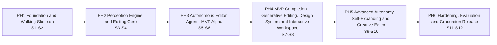
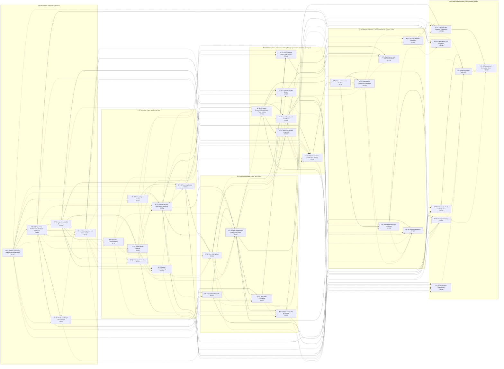

<!-- GENERATED FILE - do not edit by hand. Edit docs/roadmap/backlog/*.yaml and run `python3 tools/roadmap/build_roadmap.py`. -->

# Dependency Map

[Roadmap overview](README.md) | [Sprint plan](sprints.md) | [Milestones](milestones.md)

## Phase dependencies

## Epic dependencies

Solid arrows are declared epic dependencies; dotted arrows are derived from story-level dependencies.

## Epic dependency and parallelism table

| Epic | Phase | Sprints | Depends on (declared) | Depends on (derived from stories) | Parallel with |
|---|---|---|---|---|---|
| [EP-01](phases/phase-1-foundation.md#ep-01---product-discovery-and-architecture-baseline) Product Discovery and Architecture Baseline | PH1 | S1, S2 | - | - | EP-05 |
| [EP-02](phases/phase-1-foundation.md#ep-02---engineering-platform-and-developer-experience) Engineering Platform and Developer Experience | PH1 | S1, S2 | EP-01 | EP-04 | - |
| [EP-03](phases/phase-1-foundation.md#ep-03---identity-and-project-management) Identity and Project Management | PH1 | S1, S2 | EP-02 | EP-01 | EP-05 |
| [EP-04](phases/phase-1-foundation.md#ep-04---media-ingestion-and-multimedia-core) Media Ingestion and Multimedia Core | PH1 | S1, S2 | EP-02 | EP-03, EP-05 | - |
| [EP-05](phases/phase-1-foundation.md#ep-05---asynchronous-job-processing) Asynchronous Job Processing | PH1 | S2 | EP-02 | - | EP-01, EP-03 |
| [EP-06](phases/phase-2-perception-editing-core.md#ep-06---speech-understanding) Speech Understanding | PH2 | S3, S4 | EP-05 | EP-01, EP-04 | EP-07, EP-10 |
| [EP-07](phases/phase-2-perception-editing-core.md#ep-07---audio-understanding) Audio Understanding | PH2 | S3 | EP-05 | EP-04 | EP-06, EP-09, EP-10 |
| [EP-08](phases/phase-2-perception-editing-core.md#ep-08---visual-understanding) Visual Understanding | PH2 | S4 | EP-05 | EP-04, EP-09 | - |
| [EP-09](phases/phase-2-perception-editing-core.md#ep-09---unified-media-analysis) Unified Media Analysis | PH2 | S3, S4 | EP-05 | EP-01, EP-02, EP-04, EP-06, EP-08 | EP-07, EP-10 |
| [EP-10](phases/phase-2-perception-editing-core.md#ep-10---editing-project-model) Editing Project Model | PH2 | S3 | EP-01 | - | EP-06, EP-07, EP-09 |
| [EP-11](phases/phase-2-perception-editing-core.md#ep-11---rendering-engine) Rendering Engine | PH2 | S3, S4 | EP-05, EP-10 | EP-01, EP-12 | - |
| [EP-12](phases/phase-2-perception-editing-core.md#ep-12---editing-tool-sdk-and-media-operations) Editing Tool SDK and Media Operations | PH2 | S3, S4 | EP-10 | EP-01, EP-02, EP-04, EP-07, EP-09, EP-11 | - |
| [EP-13](phases/phase-3-agent-mvp-alpha.md#ep-13---llm-provider-layer) LLM Provider Layer | PH3 | S5 | EP-02 | EP-01 | EP-15 |
| [EP-14](phases/phase-3-agent-mvp-alpha.md#ep-14---agent-orchestrator-and-decision-loop) Agent Orchestrator and Decision Loop | PH3 | S5, S6 | EP-12, EP-13 | EP-05, EP-06, EP-09, EP-10, EP-15 | - |
| [EP-15](phases/phase-3-agent-mvp-alpha.md#ep-15---core-editing-tools) Core Editing Tools | PH3 | S5, S6 | EP-11, EP-12 | EP-06, EP-07, EP-08 | EP-13 |
| [EP-16](phases/phase-3-agent-mvp-alpha.md#ep-16---mvp-web-experience) MVP Web Experience | PH3 | S5, S6 | EP-03, EP-14 | EP-04, EP-15 | - |
| [EP-17](phases/phase-3-agent-mvp-alpha.md#ep-17---agent-safety-and-evaluation) Agent Safety and Evaluation | PH3 | S5, S6 | EP-14 | EP-01, EP-12, EP-16 | - |
| [EP-18](phases/phase-4-mvp-complete.md#ep-18---remotion-component-library-and-plugin-system) Remotion Component Library and Plugin System | PH4 | S7, S8 | EP-11, EP-12 | EP-15 | EP-20, EP-21 |
| [EP-19](phases/phase-4-mvp-complete.md#ep-19---fonts-and-design-system) Fonts and Design System | PH4 | S7 | EP-18 | EP-04, EP-12, EP-14 | EP-20, EP-21, EP-23 |
| [EP-20](phases/phase-4-mvp-complete.md#ep-20---asset-registry-and-basic-b-roll) Asset Registry and Basic B-roll | PH4 | S7, S8 | EP-04 | EP-11, EP-15 | EP-18, EP-19, EP-21, EP-22 |
| [EP-21](phases/phase-4-mvp-complete.md#ep-21---conversational-editing-and-preview) Conversational Editing and Preview | PH4 | S7, S8 | EP-14, EP-16 | EP-09, EP-10, EP-11 | EP-18, EP-19, EP-20, EP-22, EP-23 |
| [EP-22](phases/phase-4-mvp-complete.md#ep-22---basic-self-review-critic-v0) Basic Self-Review (Critic v0) | PH4 | S8 | EP-15, EP-18 | EP-14 | EP-20, EP-21 |
| [EP-23](phases/phase-4-mvp-complete.md#ep-23---platform-hardening-and-pipeline-maturity) Platform Hardening and Pipeline Maturity | PH4 | S7, S8 | EP-05 | EP-02, EP-04, EP-06, EP-08, EP-09, EP-11, EP-17, EP-20, EP-22 | EP-19, EP-21 |
| [EP-24](phases/phase-5-advanced-autonomy.md#ep-24---secure-execution-sandbox) Secure Execution Sandbox | PH5 | S9 | EP-23 | - | EP-27 |
| [EP-25](phases/phase-5-advanced-autonomy.md#ep-25---autonomous-component-generation) Autonomous Component Generation | PH5 | S9, S10 | EP-18, EP-24 | EP-12, EP-22 | EP-27 |
| [EP-26](phases/phase-5-advanced-autonomy.md#ep-26---external-resource-acquisition) External Resource Acquisition | PH5 | S9, S10 | EP-20, EP-24 | EP-25 | EP-27, EP-29 |
| [EP-27](phases/phase-5-advanced-autonomy.md#ep-27---ai-critic-and-self-refinement) AI Critic and Self-Refinement | PH5 | S9, S10 | EP-22 | EP-13 | EP-24, EP-25, EP-26, EP-28, EP-29 |
| [EP-28](phases/phase-5-advanced-autonomy.md#ep-28---creative-intelligence) Creative Intelligence | PH5 | S9, S10 | EP-14, EP-20 | EP-18, EP-19, EP-22, EP-25, EP-26 | EP-27, EP-29 |
| [EP-29](phases/phase-5-advanced-autonomy.md#ep-29---workspace-and-brand-experience) Workspace and Brand Experience | PH5 | S9, S10 | EP-19, EP-21 | EP-16, EP-20, EP-25 | EP-26, EP-27, EP-28 |
| [EP-30](phases/phase-6-hardening-release.md#ep-30---security-hardening) Security Hardening | PH6 | S11 | EP-17, EP-24, EP-26 | EP-03, EP-23, EP-28 | EP-31, EP-32, EP-33 |
| [EP-31](phases/phase-6-hardening-release.md#ep-31---performance-optimization) Performance Optimization | PH6 | S11 | EP-09, EP-11 | EP-06, EP-08, EP-15, EP-17, EP-23 | EP-30, EP-32, EP-33 |
| [EP-32](phases/phase-6-hardening-release.md#ep-32---observability-and-debugging) Observability and Debugging | PH6 | S11 | EP-02, EP-14 | EP-27 | EP-30, EP-31, EP-33 |
| [EP-33](phases/phase-6-hardening-release.md#ep-33---extensibility-proof-and-stabilization) Extensibility Proof and Stabilization | PH6 | S11 | EP-12, EP-13, EP-18 | - | EP-30, EP-31, EP-32 |
| [EP-34](phases/phase-6-hardening-release.md#ep-34---evaluation-and-research-contribution) Evaluation and Research Contribution | PH6 | S12 | EP-17, EP-27 | EP-21, EP-25, EP-26 | EP-35 |
| [EP-35](phases/phase-6-hardening-release.md#ep-35---documentation) Documentation | PH6 | S12 | EP-33 | EP-01, EP-29, EP-30, EP-31 | EP-34 |
| [EP-36](phases/phase-6-hardening-release.md#ep-36---release-and-graduation-demo) Release and Graduation Demo | PH6 | S12 | EP-34, EP-35 | EP-33 | - |

## Critical path

Longest chain of dependent stories weighted by story points. Any slip on these stories moves the final milestone; they get first pick of reviewers and are never left unassigned at sprint start.

| # | Story | Sprint | SP | Lane |
|---|---|---|---|---|
| 1 | [US-103](phases/phase-1-foundation.md#us-103---architecture-baseline-module-boundaries-and-adrs) Architecture baseline, module boundaries and ADRs | 1 | 5 | BE |
| 2 | [US-111](phases/phase-1-foundation.md#us-111---monorepo-scaffold-with-enforced-architecture-rules) Monorepo scaffold with enforced architecture rules | 1 | 5 | OPS |
| 3 | [US-114](phases/phase-1-foundation.md#us-114---docker-compose-environment-with-typed-configuration) Docker Compose environment with typed configuration | 1 | 5 | OPS |
| 4 | [US-129](phases/phase-1-foundation.md#us-129---job-queue-abstraction-with-job-state-machine) Job queue abstraction with job state machine | 2 | 5 | BE |
| 5 | [US-216](phases/phase-2-perception-editing-core.md#us-216---remotion-render-worker) Remotion render worker | 3 | 5 | GEN |
| 6 | [US-217](phases/phase-2-perception-editing-core.md#us-217---timeline-to-remotion-composition-mapping) Timeline to Remotion composition mapping | 4 | 5 | GEN |
| 7 | [US-401](phases/phase-4-mvp-complete.md#us-401---component-manifest-and-plugin-registry) Component manifest and plugin registry | 7 | 5 | GEN |
| 8 | [US-402](phases/phase-4-mvp-complete.md#us-402---motion-graphics-pack-v1) Motion graphics pack v1 | 7 | 5 | GEN |
| 9 | [US-405](phases/phase-4-mvp-complete.md#us-405---layout-metadata-emission-for-quality-checks) Layout metadata emission for quality checks | 8 | 3 | GEN |
| 10 | [US-419](phases/phase-4-mvp-complete.md#us-419---deterministic-render-quality-checks) Deterministic render quality checks | 8 | 5 | MM |
| 11 | [US-511](phases/phase-5-advanced-autonomy.md#us-511---multimodal-visual-critique) Multimodal visual critique | 10 | 5 | AI |
| 12 | [US-513](phases/phase-5-advanced-autonomy.md#us-513---iterative-refinement-loop-controller) Iterative refinement loop controller | 10 | 3 | AI |
| 13 | [US-613](phases/phase-6-hardening-release.md#us-613---full-evaluation-run-with-ablations) Full evaluation run with ablations | 12 | 5 | AI |
| 14 | [US-614](phases/phase-6-hardening-release.md#us-614---human-acceptance-study) Human acceptance study | 12 | 3 | FE |

## Story dependency register

| Story | Sprint | Depends on | Dependency sprint | Type |
|---|---|---|---|---|
| [US-104](phases/phase-1-foundation.md#us-104---initial-domain-model-and-er-design) Initial domain model and ER design | Sprint 1 | [US-102](phases/phase-1-foundation.md#us-102---use-cases-user-journeys-and-domain-glossary) Use cases, user journeys and domain glossary | Sprint 1 | same sprint (sequential) |
| [US-108](phases/phase-1-foundation.md#us-108---risk-register-and-threat-model-v0) Risk register and threat model v0 | Sprint 1 | [US-103](phases/phase-1-foundation.md#us-103---architecture-baseline-module-boundaries-and-adrs) Architecture baseline, module boundaries and ADRs | Sprint 1 | same sprint (sequential) |
| [US-110](phases/phase-1-foundation.md#us-110---evaluation-dataset-collection-and-metric-definitions) Evaluation dataset collection and metric definitions | Sprint 2 | [US-101](phases/phase-1-foundation.md#us-101---software-requirements-specification-with-measurable-nfrs) Software Requirements Specification with measurable NFRs | Sprint 1 | earlier sprint |
| [US-111](phases/phase-1-foundation.md#us-111---monorepo-scaffold-with-enforced-architecture-rules) Monorepo scaffold with enforced architecture rules | Sprint 1 | [US-103](phases/phase-1-foundation.md#us-103---architecture-baseline-module-boundaries-and-adrs) Architecture baseline, module boundaries and ADRs | Sprint 1 | same sprint (sequential) |
| [US-112](phases/phase-1-foundation.md#us-112---ci-pipeline-baseline-with-required-checks) CI pipeline baseline with required checks | Sprint 1 | [US-111](phases/phase-1-foundation.md#us-111---monorepo-scaffold-with-enforced-architecture-rules) Monorepo scaffold with enforced architecture rules | Sprint 1 | same sprint (sequential) |
| [US-113](phases/phase-1-foundation.md#us-113---supply-chain-security-image-publishing-and-cd-to-staging) Supply-chain security, image publishing and CD to staging | Sprint 2 | [US-112](phases/phase-1-foundation.md#us-112---ci-pipeline-baseline-with-required-checks) CI pipeline baseline with required checks | Sprint 1 | earlier sprint |
| [US-113](phases/phase-1-foundation.md#us-113---supply-chain-security-image-publishing-and-cd-to-staging) Supply-chain security, image publishing and CD to staging | Sprint 2 | [US-114](phases/phase-1-foundation.md#us-114---docker-compose-environment-with-typed-configuration) Docker Compose environment with typed configuration | Sprint 1 | earlier sprint |
| [US-114](phases/phase-1-foundation.md#us-114---docker-compose-environment-with-typed-configuration) Docker Compose environment with typed configuration | Sprint 1 | [US-111](phases/phase-1-foundation.md#us-111---monorepo-scaffold-with-enforced-architecture-rules) Monorepo scaffold with enforced architecture rules | Sprint 1 | same sprint (sequential) |
| [US-115](phases/phase-1-foundation.md#us-115---structured-logging-health-checks-and-error-handling-baseline) Structured logging, health checks and error handling baseline | Sprint 2 | [US-114](phases/phase-1-foundation.md#us-114---docker-compose-environment-with-typed-configuration) Docker Compose environment with typed configuration | Sprint 1 | earlier sprint |
| [US-116](phases/phase-1-foundation.md#us-116---test-frameworks-fixtures-and-integration-harness) Test frameworks, fixtures and integration harness | Sprint 2 | [US-111](phases/phase-1-foundation.md#us-111---monorepo-scaffold-with-enforced-architecture-rules) Monorepo scaffold with enforced architecture rules | Sprint 1 | earlier sprint |
| [US-117](phases/phase-1-foundation.md#us-117---walking-skeleton-end-to-end-test-in-ci) Walking-skeleton end-to-end test in CI | Sprint 2 | [US-116](phases/phase-1-foundation.md#us-116---test-frameworks-fixtures-and-integration-harness) Test frameworks, fixtures and integration harness | Sprint 2 | same sprint (sequential) |
| [US-117](phases/phase-1-foundation.md#us-117---walking-skeleton-end-to-end-test-in-ci) Walking-skeleton end-to-end test in CI | Sprint 2 | [US-126](phases/phase-1-foundation.md#us-126---media-metadata-extraction-with-ffprobe) Media metadata extraction with FFprobe | Sprint 1 | earlier sprint |
| [US-117](phases/phase-1-foundation.md#us-117---walking-skeleton-end-to-end-test-in-ci) Walking-skeleton end-to-end test in CI | Sprint 2 | [US-124](phases/phase-1-foundation.md#us-124---upload-and-media-details-page) Upload and media details page | Sprint 1 | earlier sprint |
| [US-118](phases/phase-1-foundation.md#us-118---secure-authentication-and-project-level-authorization) Secure authentication and project-level authorization | Sprint 2 | [US-120](phases/phase-1-foundation.md#us-120---project-crud-api) Project CRUD API | Sprint 1 | earlier sprint |
| [US-119](phases/phase-1-foundation.md#us-119---sign-up-sign-in-and-session-handling-in-the-web-app) Sign-up, sign-in and session handling in the web app | Sprint 2 | [US-118](phases/phase-1-foundation.md#us-118---secure-authentication-and-project-level-authorization) Secure authentication and project-level authorization | Sprint 2 | same sprint (sequential) |
| [US-119](phases/phase-1-foundation.md#us-119---sign-up-sign-in-and-session-handling-in-the-web-app) Sign-up, sign-in and session handling in the web app | Sprint 2 | [US-121](phases/phase-1-foundation.md#us-121---web-application-shell-and-project-dashboard) Web application shell and project dashboard | Sprint 1 | earlier sprint |
| [US-120](phases/phase-1-foundation.md#us-120---project-crud-api) Project CRUD API | Sprint 1 | [US-104](phases/phase-1-foundation.md#us-104---initial-domain-model-and-er-design) Initial domain model and ER design | Sprint 1 | same sprint (sequential) |
| [US-121](phases/phase-1-foundation.md#us-121---web-application-shell-and-project-dashboard) Web application shell and project dashboard | Sprint 1 | [US-111](phases/phase-1-foundation.md#us-111---monorepo-scaffold-with-enforced-architecture-rules) Monorepo scaffold with enforced architecture rules | Sprint 1 | same sprint (sequential) |
| [US-122](phases/phase-1-foundation.md#us-122---object-storage-port-and-direct-upload) Object storage port and direct upload | Sprint 1 | [US-120](phases/phase-1-foundation.md#us-120---project-crud-api) Project CRUD API | Sprint 1 | same sprint (sequential) |
| [US-123](phases/phase-1-foundation.md#us-123---resumable-large-file-upload) Resumable large-file upload | Sprint 2 | [US-122](phases/phase-1-foundation.md#us-122---object-storage-port-and-direct-upload) Object storage port and direct upload | Sprint 1 | earlier sprint |
| [US-124](phases/phase-1-foundation.md#us-124---upload-and-media-details-page) Upload and media details page | Sprint 1 | [US-121](phases/phase-1-foundation.md#us-121---web-application-shell-and-project-dashboard) Web application shell and project dashboard | Sprint 1 | same sprint (sequential) |
| [US-125](phases/phase-1-foundation.md#us-125---media-library-with-thumbnails-and-proxy-playback) Media library with thumbnails and proxy playback | Sprint 2 | [US-128](phases/phase-1-foundation.md#us-128---proxy-audio-extraction-and-thumbnail-generation) Proxy, audio extraction and thumbnail generation | Sprint 2 | same sprint (sequential) |
| [US-125](phases/phase-1-foundation.md#us-125---media-library-with-thumbnails-and-proxy-playback) Media library with thumbnails and proxy playback | Sprint 2 | [US-124](phases/phase-1-foundation.md#us-124---upload-and-media-details-page) Upload and media details page | Sprint 1 | earlier sprint |
| [US-126](phases/phase-1-foundation.md#us-126---media-metadata-extraction-with-ffprobe) Media metadata extraction with FFprobe | Sprint 1 | [US-111](phases/phase-1-foundation.md#us-111---monorepo-scaffold-with-enforced-architecture-rules) Monorepo scaffold with enforced architecture rules | Sprint 1 | same sprint (sequential) |
| [US-127](phases/phase-1-foundation.md#us-127---media-validation-and-hostile-file-defense) Media validation and hostile-file defense | Sprint 2 | [US-126](phases/phase-1-foundation.md#us-126---media-metadata-extraction-with-ffprobe) Media metadata extraction with FFprobe | Sprint 1 | earlier sprint |
| [US-127](phases/phase-1-foundation.md#us-127---media-validation-and-hostile-file-defense) Media validation and hostile-file defense | Sprint 2 | [US-129](phases/phase-1-foundation.md#us-129---job-queue-abstraction-with-job-state-machine) Job queue abstraction with job state machine | Sprint 2 | same sprint (sequential) |
| [US-128](phases/phase-1-foundation.md#us-128---proxy-audio-extraction-and-thumbnail-generation) Proxy, audio extraction and thumbnail generation | Sprint 2 | [US-126](phases/phase-1-foundation.md#us-126---media-metadata-extraction-with-ffprobe) Media metadata extraction with FFprobe | Sprint 1 | earlier sprint |
| [US-128](phases/phase-1-foundation.md#us-128---proxy-audio-extraction-and-thumbnail-generation) Proxy, audio extraction and thumbnail generation | Sprint 2 | [US-129](phases/phase-1-foundation.md#us-129---job-queue-abstraction-with-job-state-machine) Job queue abstraction with job state machine | Sprint 2 | same sprint (sequential) |
| [US-129](phases/phase-1-foundation.md#us-129---job-queue-abstraction-with-job-state-machine) Job queue abstraction with job state machine | Sprint 2 | [US-114](phases/phase-1-foundation.md#us-114---docker-compose-environment-with-typed-configuration) Docker Compose environment with typed configuration | Sprint 1 | earlier sprint |
| [US-130](phases/phase-1-foundation.md#us-130---real-time-job-progress-events) Real-time job progress events | Sprint 2 | [US-129](phases/phase-1-foundation.md#us-129---job-queue-abstraction-with-job-state-machine) Job queue abstraction with job state machine | Sprint 2 | same sprint (sequential) |
| [US-131](phases/phase-1-foundation.md#us-131---job-progress-and-status-ui) Job progress and status UI | Sprint 2 | [US-130](phases/phase-1-foundation.md#us-130---real-time-job-progress-events) Real-time job progress events | Sprint 2 | same sprint (sequential) |
| [US-201](phases/phase-2-perception-editing-core.md#us-201---word-level-transcription-with-faster-whisper) Word-level transcription with Faster-Whisper | Sprint 3 | [US-105](phases/phase-1-foundation.md#us-105---asr-and-vad-feasibility-spike) ASR and VAD feasibility spike | Sprint 1 | cross-phase |
| [US-201](phases/phase-2-perception-editing-core.md#us-201---word-level-transcription-with-faster-whisper) Word-level transcription with Faster-Whisper | Sprint 3 | [US-128](phases/phase-1-foundation.md#us-128---proxy-audio-extraction-and-thumbnail-generation) Proxy, audio extraction and thumbnail generation | Sprint 2 | cross-phase |
| [US-201](phases/phase-2-perception-editing-core.md#us-201---word-level-transcription-with-faster-whisper) Word-level transcription with Faster-Whisper | Sprint 3 | [US-129](phases/phase-1-foundation.md#us-129---job-queue-abstraction-with-job-state-machine) Job queue abstraction with job state machine | Sprint 2 | cross-phase |
| [US-202](phases/phase-2-perception-editing-core.md#us-202---voice-activity-detection-and-speech-segmentation) Voice activity detection and speech segmentation | Sprint 3 | [US-128](phases/phase-1-foundation.md#us-128---proxy-audio-extraction-and-thumbnail-generation) Proxy, audio extraction and thumbnail generation | Sprint 2 | cross-phase |
| [US-203](phases/phase-2-perception-editing-core.md#us-203---filler-word-and-repetition-detection) Filler-word and repetition detection | Sprint 4 | [US-201](phases/phase-2-perception-editing-core.md#us-201---word-level-transcription-with-faster-whisper) Word-level transcription with Faster-Whisper | Sprint 3 | earlier sprint |
| [US-204](phases/phase-2-perception-editing-core.md#us-204---silence-loudness-peak-and-energy-analysis) Silence, loudness, peak and energy analysis | Sprint 3 | [US-128](phases/phase-1-foundation.md#us-128---proxy-audio-extraction-and-thumbnail-generation) Proxy, audio extraction and thumbnail generation | Sprint 2 | cross-phase |
| [US-205](phases/phase-2-perception-editing-core.md#us-205---speech-music-and-noise-classification) Speech, music and noise classification | Stretch | [US-204](phases/phase-2-perception-editing-core.md#us-204---silence-loudness-peak-and-energy-analysis) Silence, loudness, peak and energy analysis | Sprint 3 | stretch |
| [US-206](phases/phase-2-perception-editing-core.md#us-206---shot-and-scene-boundary-detection) Shot and scene boundary detection | Sprint 4 | [US-128](phases/phase-1-foundation.md#us-128---proxy-audio-extraction-and-thumbnail-generation) Proxy, audio extraction and thumbnail generation | Sprint 2 | cross-phase |
| [US-206](phases/phase-2-perception-editing-core.md#us-206---shot-and-scene-boundary-detection) Shot and scene boundary detection | Sprint 4 | [US-208](phases/phase-2-perception-editing-core.md#us-208---versioned-mediaanalysis-json-schema-with-generated-bindings) Versioned MediaAnalysis JSON Schema with generated bindings | Sprint 3 | earlier sprint |
| [US-207](phases/phase-2-perception-editing-core.md#us-207---face-detection-and-tracking) Face detection and tracking | Sprint 4 | [US-128](phases/phase-1-foundation.md#us-128---proxy-audio-extraction-and-thumbnail-generation) Proxy, audio extraction and thumbnail generation | Sprint 2 | cross-phase |
| [US-207](phases/phase-2-perception-editing-core.md#us-207---face-detection-and-tracking) Face detection and tracking | Sprint 4 | [US-208](phases/phase-2-perception-editing-core.md#us-208---versioned-mediaanalysis-json-schema-with-generated-bindings) Versioned MediaAnalysis JSON Schema with generated bindings | Sprint 3 | earlier sprint |
| [US-208](phases/phase-2-perception-editing-core.md#us-208---versioned-mediaanalysis-json-schema-with-generated-bindings) Versioned MediaAnalysis JSON Schema with generated bindings | Sprint 3 | [US-103](phases/phase-1-foundation.md#us-103---architecture-baseline-module-boundaries-and-adrs) Architecture baseline, module boundaries and ADRs | Sprint 1 | cross-phase |
| [US-209](phases/phase-2-perception-editing-core.md#us-209---worker-integration-test-harness-and-gpu-test-strategy) Worker integration test harness and GPU test strategy | Sprint 3 | [US-116](phases/phase-1-foundation.md#us-116---test-frameworks-fixtures-and-integration-harness) Test frameworks, fixtures and integration harness | Sprint 2 | cross-phase |
| [US-210](phases/phase-2-perception-editing-core.md#us-210---analysis-orchestration-and-aggregation) Analysis orchestration and aggregation | Sprint 3 | [US-208](phases/phase-2-perception-editing-core.md#us-208---versioned-mediaanalysis-json-schema-with-generated-bindings) Versioned MediaAnalysis JSON Schema with generated bindings | Sprint 3 | same sprint (sequential) |
| [US-210](phases/phase-2-perception-editing-core.md#us-210---analysis-orchestration-and-aggregation) Analysis orchestration and aggregation | Sprint 3 | [US-129](phases/phase-1-foundation.md#us-129---job-queue-abstraction-with-job-state-machine) Job queue abstraction with job state machine | Sprint 2 | cross-phase |
| [US-211](phases/phase-2-perception-editing-core.md#us-211---frame-accurate-video-player-component) Frame-accurate video player component | Sprint 3 | [US-125](phases/phase-1-foundation.md#us-125---media-library-with-thumbnails-and-proxy-playback) Media library with thumbnails and proxy playback | Sprint 2 | cross-phase |
| [US-212](phases/phase-2-perception-editing-core.md#us-212---synchronized-transcript-viewer) Synchronized transcript viewer | Sprint 3 | [US-201](phases/phase-2-perception-editing-core.md#us-201---word-level-transcription-with-faster-whisper) Word-level transcription with Faster-Whisper | Sprint 3 | same sprint (sequential) |
| [US-212](phases/phase-2-perception-editing-core.md#us-212---synchronized-transcript-viewer) Synchronized transcript viewer | Sprint 3 | [US-211](phases/phase-2-perception-editing-core.md#us-211---frame-accurate-video-player-component) Frame-accurate video player component | Sprint 3 | same sprint (sequential) |
| [US-213](phases/phase-2-perception-editing-core.md#us-213---analysis-overview-panels) Analysis overview panels | Sprint 4 | [US-210](phases/phase-2-perception-editing-core.md#us-210---analysis-orchestration-and-aggregation) Analysis orchestration and aggregation | Sprint 3 | earlier sprint |
| [US-213](phases/phase-2-perception-editing-core.md#us-213---analysis-overview-panels) Analysis overview panels | Sprint 4 | [US-206](phases/phase-2-perception-editing-core.md#us-206---shot-and-scene-boundary-detection) Shot and scene boundary detection | Sprint 4 | same sprint (sequential) |
| [US-213](phases/phase-2-perception-editing-core.md#us-213---analysis-overview-panels) Analysis overview panels | Sprint 4 | [US-207](phases/phase-2-perception-editing-core.md#us-207---face-detection-and-tracking) Face detection and tracking | Sprint 4 | same sprint (sequential) |
| [US-214](phases/phase-2-perception-editing-core.md#us-214---timeline-domain-model-and-invariants) Timeline domain model and invariants | Sprint 3 | [US-104](phases/phase-1-foundation.md#us-104---initial-domain-model-and-er-design) Initial domain model and ER design | Sprint 1 | cross-phase |
| [US-215](phases/phase-2-perception-editing-core.md#us-215---edit-commands-with-undo-redo-and-replayable-history) Edit commands with undo, redo and replayable history | Sprint 3 | [US-214](phases/phase-2-perception-editing-core.md#us-214---timeline-domain-model-and-invariants) Timeline domain model and invariants | Sprint 3 | same sprint (sequential) |
| [US-216](phases/phase-2-perception-editing-core.md#us-216---remotion-render-worker) Remotion render worker | Sprint 3 | [US-106](phases/phase-1-foundation.md#us-106---rendering-feasibility-spike-ffmpeg-vs-remotion) Rendering feasibility spike (FFmpeg vs Remotion) | Sprint 1 | cross-phase |
| [US-216](phases/phase-2-perception-editing-core.md#us-216---remotion-render-worker) Remotion render worker | Sprint 3 | [US-129](phases/phase-1-foundation.md#us-129---job-queue-abstraction-with-job-state-machine) Job queue abstraction with job state machine | Sprint 2 | cross-phase |
| [US-217](phases/phase-2-perception-editing-core.md#us-217---timeline-to-remotion-composition-mapping) Timeline to Remotion composition mapping | Sprint 4 | [US-214](phases/phase-2-perception-editing-core.md#us-214---timeline-domain-model-and-invariants) Timeline domain model and invariants | Sprint 3 | earlier sprint |
| [US-217](phases/phase-2-perception-editing-core.md#us-217---timeline-to-remotion-composition-mapping) Timeline to Remotion composition mapping | Sprint 4 | [US-216](phases/phase-2-perception-editing-core.md#us-216---remotion-render-worker) Remotion render worker | Sprint 3 | earlier sprint |
| [US-218](phases/phase-2-perception-editing-core.md#us-218---ffmpeg-render-strategy-behind-irenderstrategy) FFmpeg render strategy behind IRenderStrategy | Sprint 4 | [US-214](phases/phase-2-perception-editing-core.md#us-214---timeline-domain-model-and-invariants) Timeline domain model and invariants | Sprint 3 | earlier sprint |
| [US-218](phases/phase-2-perception-editing-core.md#us-218---ffmpeg-render-strategy-behind-irenderstrategy) FFmpeg render strategy behind IRenderStrategy | Sprint 4 | [US-220](phases/phase-2-perception-editing-core.md#us-220---safe-ffmpeg-command-builder) Safe FFmpeg command builder | Sprint 3 | earlier sprint |
| [US-219](phases/phase-2-perception-editing-core.md#us-219---tool-manifest-registry-and-schema-validation) Tool manifest, registry and schema validation | Sprint 4 | [US-103](phases/phase-1-foundation.md#us-103---architecture-baseline-module-boundaries-and-adrs) Architecture baseline, module boundaries and ADRs | Sprint 1 | cross-phase |
| [US-219](phases/phase-2-perception-editing-core.md#us-219---tool-manifest-registry-and-schema-validation) Tool manifest, registry and schema validation | Sprint 4 | [US-208](phases/phase-2-perception-editing-core.md#us-208---versioned-mediaanalysis-json-schema-with-generated-bindings) Versioned MediaAnalysis JSON Schema with generated bindings | Sprint 3 | earlier sprint |
| [US-220](phases/phase-2-perception-editing-core.md#us-220---safe-ffmpeg-command-builder) Safe FFmpeg command builder | Sprint 3 | [US-126](phases/phase-1-foundation.md#us-126---media-metadata-extraction-with-ffprobe) Media metadata extraction with FFprobe | Sprint 1 | cross-phase |
| [US-221](phases/phase-2-perception-editing-core.md#us-221---tool-executor-with-permissions-timeouts-and-remote-dispatch) Tool executor with permissions, timeouts and remote dispatch | Sprint 4 | [US-219](phases/phase-2-perception-editing-core.md#us-219---tool-manifest-registry-and-schema-validation) Tool manifest, registry and schema validation | Sprint 4 | same sprint (sequential) |
| [US-222](phases/phase-2-perception-editing-core.md#us-222---core-ffmpeg-editing-tools) Core FFmpeg editing tools | Sprint 4 | [US-219](phases/phase-2-perception-editing-core.md#us-219---tool-manifest-registry-and-schema-validation) Tool manifest, registry and schema validation | Sprint 4 | same sprint (sequential) |
| [US-222](phases/phase-2-perception-editing-core.md#us-222---core-ffmpeg-editing-tools) Core FFmpeg editing tools | Sprint 4 | [US-220](phases/phase-2-perception-editing-core.md#us-220---safe-ffmpeg-command-builder) Safe FFmpeg command builder | Sprint 3 | earlier sprint |
| [US-223](phases/phase-2-perception-editing-core.md#us-223---one-click-silence-removal-workflow) One-click silence removal workflow | Sprint 4 | [US-204](phases/phase-2-perception-editing-core.md#us-204---silence-loudness-peak-and-energy-analysis) Silence, loudness, peak and energy analysis | Sprint 3 | earlier sprint |
| [US-223](phases/phase-2-perception-editing-core.md#us-223---one-click-silence-removal-workflow) One-click silence removal workflow | Sprint 4 | [US-215](phases/phase-2-perception-editing-core.md#us-215---edit-commands-with-undo-redo-and-replayable-history) Edit commands with undo, redo and replayable history | Sprint 3 | earlier sprint |
| [US-223](phases/phase-2-perception-editing-core.md#us-223---one-click-silence-removal-workflow) One-click silence removal workflow | Sprint 4 | [US-218](phases/phase-2-perception-editing-core.md#us-218---ffmpeg-render-strategy-behind-irenderstrategy) FFmpeg render strategy behind IRenderStrategy | Sprint 4 | same sprint (sequential) |
| [US-223](phases/phase-2-perception-editing-core.md#us-223---one-click-silence-removal-workflow) One-click silence removal workflow | Sprint 4 | [US-221](phases/phase-2-perception-editing-core.md#us-221---tool-executor-with-permissions-timeouts-and-remote-dispatch) Tool executor with permissions, timeouts and remote dispatch | Sprint 4 | same sprint (sequential) |
| [US-223](phases/phase-2-perception-editing-core.md#us-223---one-click-silence-removal-workflow) One-click silence removal workflow | Sprint 4 | [US-222](phases/phase-2-perception-editing-core.md#us-222---core-ffmpeg-editing-tools) Core FFmpeg editing tools | Sprint 4 | same sprint (sequential) |
| [US-224](phases/phase-2-perception-editing-core.md#us-224---silence-removal-action-and-result-download-in-the-web-app) Silence removal action and result download in the web app | Sprint 4 | [US-223](phases/phase-2-perception-editing-core.md#us-223---one-click-silence-removal-workflow) One-click silence removal workflow | Sprint 4 | same sprint (sequential) |
| [US-225](phases/phase-2-perception-editing-core.md#us-225---end-to-end-test-of-the-silence-removal-workflow) End-to-end test of the silence removal workflow | Sprint 4 | [US-117](phases/phase-1-foundation.md#us-117---walking-skeleton-end-to-end-test-in-ci) Walking-skeleton end-to-end test in CI | Sprint 2 | cross-phase |
| [US-225](phases/phase-2-perception-editing-core.md#us-225---end-to-end-test-of-the-silence-removal-workflow) End-to-end test of the silence removal workflow | Sprint 4 | [US-223](phases/phase-2-perception-editing-core.md#us-223---one-click-silence-removal-workflow) One-click silence removal workflow | Sprint 4 | same sprint (sequential) |
| [US-225](phases/phase-2-perception-editing-core.md#us-225---end-to-end-test-of-the-silence-removal-workflow) End-to-end test of the silence removal workflow | Sprint 4 | [US-224](phases/phase-2-perception-editing-core.md#us-224---silence-removal-action-and-result-download-in-the-web-app) Silence removal action and result download in the web app | Sprint 4 | same sprint (sequential) |
| [US-301](phases/phase-3-agent-mvp-alpha.md#us-301---llm-provider-port-with-capability-descriptors-and-adapters) LLM provider port with capability descriptors and adapters | Sprint 5 | [US-103](phases/phase-1-foundation.md#us-103---architecture-baseline-module-boundaries-and-adrs) Architecture baseline, module boundaries and ADRs | Sprint 1 | cross-phase |
| [US-301](phases/phase-3-agent-mvp-alpha.md#us-301---llm-provider-port-with-capability-descriptors-and-adapters) LLM provider port with capability descriptors and adapters | Sprint 5 | [US-107](phases/phase-1-foundation.md#us-107---llm-tool-calling-feasibility-spike) LLM tool-calling feasibility spike | Sprint 1 | cross-phase |
| [US-302](phases/phase-3-agent-mvp-alpha.md#us-302---versioned-prompt-registry) Versioned prompt registry | Sprint 5 | [US-111](phases/phase-1-foundation.md#us-111---monorepo-scaffold-with-enforced-architecture-rules) Monorepo scaffold with enforced architecture rules | Sprint 1 | cross-phase |
| [US-303](phases/phase-3-agent-mvp-alpha.md#us-303---agentrun-lifecycle-agent-worker-and-run-api) AgentRun lifecycle, agent worker and run API | Sprint 5 | [US-129](phases/phase-1-foundation.md#us-129---job-queue-abstraction-with-job-state-machine) Job queue abstraction with job state machine | Sprint 2 | cross-phase |
| [US-303](phases/phase-3-agent-mvp-alpha.md#us-303---agentrun-lifecycle-agent-worker-and-run-api) AgentRun lifecycle, agent worker and run API | Sprint 5 | [US-215](phases/phase-2-perception-editing-core.md#us-215---edit-commands-with-undo-redo-and-replayable-history) Edit commands with undo, redo and replayable history | Sprint 3 | cross-phase |
| [US-304](phases/phase-3-agent-mvp-alpha.md#us-304---agent-context-builder-with-token-budgeting) Agent context builder with token budgeting | Sprint 5 | [US-210](phases/phase-2-perception-editing-core.md#us-210---analysis-orchestration-and-aggregation) Analysis orchestration and aggregation | Sprint 3 | cross-phase |
| [US-304](phases/phase-3-agent-mvp-alpha.md#us-304---agent-context-builder-with-token-budgeting) Agent context builder with token budgeting | Sprint 5 | [US-219](phases/phase-2-perception-editing-core.md#us-219---tool-manifest-registry-and-schema-validation) Tool manifest, registry and schema validation | Sprint 4 | cross-phase |
| [US-304](phases/phase-3-agent-mvp-alpha.md#us-304---agent-context-builder-with-token-budgeting) Agent context builder with token budgeting | Sprint 5 | [US-302](phases/phase-3-agent-mvp-alpha.md#us-302---versioned-prompt-registry) Versioned prompt registry | Sprint 5 | same sprint (sequential) |
| [US-305](phases/phase-3-agent-mvp-alpha.md#us-305---observe-plan-act-loop-with-validated-tool-calling) Observe-plan-act loop with validated tool calling | Sprint 5 | [US-221](phases/phase-2-perception-editing-core.md#us-221---tool-executor-with-permissions-timeouts-and-remote-dispatch) Tool executor with permissions, timeouts and remote dispatch | Sprint 4 | cross-phase |
| [US-305](phases/phase-3-agent-mvp-alpha.md#us-305---observe-plan-act-loop-with-validated-tool-calling) Observe-plan-act loop with validated tool calling | Sprint 5 | [US-301](phases/phase-3-agent-mvp-alpha.md#us-301---llm-provider-port-with-capability-descriptors-and-adapters) LLM provider port with capability descriptors and adapters | Sprint 5 | same sprint (sequential) |
| [US-305](phases/phase-3-agent-mvp-alpha.md#us-305---observe-plan-act-loop-with-validated-tool-calling) Observe-plan-act loop with validated tool calling | Sprint 5 | [US-303](phases/phase-3-agent-mvp-alpha.md#us-303---agentrun-lifecycle-agent-worker-and-run-api) AgentRun lifecycle, agent worker and run API | Sprint 5 | same sprint (sequential) |
| [US-305](phases/phase-3-agent-mvp-alpha.md#us-305---observe-plan-act-loop-with-validated-tool-calling) Observe-plan-act loop with validated tool calling | Sprint 5 | [US-304](phases/phase-3-agent-mvp-alpha.md#us-304---agent-context-builder-with-token-budgeting) Agent context builder with token budgeting | Sprint 5 | same sprint (sequential) |
| [US-306](phases/phase-3-agent-mvp-alpha.md#us-306---agent-event-stream-and-audit-trail-api) Agent event stream and audit trail API | Sprint 6 | [US-130](phases/phase-1-foundation.md#us-130---real-time-job-progress-events) Real-time job progress events | Sprint 2 | cross-phase |
| [US-306](phases/phase-3-agent-mvp-alpha.md#us-306---agent-event-stream-and-audit-trail-api) Agent event stream and audit trail API | Sprint 6 | [US-303](phases/phase-3-agent-mvp-alpha.md#us-303---agentrun-lifecycle-agent-worker-and-run-api) AgentRun lifecycle, agent worker and run API | Sprint 5 | earlier sprint |
| [US-307](phases/phase-3-agent-mvp-alpha.md#us-307---highlight-selection-and-semantic-cutting) Highlight selection and semantic cutting | Sprint 6 | [US-201](phases/phase-2-perception-editing-core.md#us-201---word-level-transcription-with-faster-whisper) Word-level transcription with Faster-Whisper | Sprint 3 | cross-phase |
| [US-307](phases/phase-3-agent-mvp-alpha.md#us-307---highlight-selection-and-semantic-cutting) Highlight selection and semantic cutting | Sprint 6 | [US-305](phases/phase-3-agent-mvp-alpha.md#us-305---observe-plan-act-loop-with-validated-tool-calling) Observe-plan-act loop with validated tool calling | Sprint 5 | earlier sprint |
| [US-308](phases/phase-3-agent-mvp-alpha.md#us-308---short-form-generation-for-platform-presets) Short-form generation for platform presets | Sprint 6 | [US-307](phases/phase-3-agent-mvp-alpha.md#us-307---highlight-selection-and-semantic-cutting) Highlight selection and semantic cutting | Sprint 6 | same sprint (sequential) |
| [US-308](phases/phase-3-agent-mvp-alpha.md#us-308---short-form-generation-for-platform-presets) Short-form generation for platform presets | Sprint 6 | [US-310](phases/phase-3-agent-mvp-alpha.md#us-310---auto-reframing-to-target-aspect-ratio) Auto-reframing to target aspect ratio | Sprint 5 | earlier sprint |
| [US-309](phases/phase-3-agent-mvp-alpha.md#us-309---range-removal-tool-for-silences-fillers-and-repetitions) Range removal tool for silences, fillers and repetitions | Sprint 5 | [US-203](phases/phase-2-perception-editing-core.md#us-203---filler-word-and-repetition-detection) Filler-word and repetition detection | Sprint 4 | cross-phase |
| [US-309](phases/phase-3-agent-mvp-alpha.md#us-309---range-removal-tool-for-silences-fillers-and-repetitions) Range removal tool for silences, fillers and repetitions | Sprint 5 | [US-223](phases/phase-2-perception-editing-core.md#us-223---one-click-silence-removal-workflow) One-click silence removal workflow | Sprint 4 | cross-phase |
| [US-310](phases/phase-3-agent-mvp-alpha.md#us-310---auto-reframing-to-target-aspect-ratio) Auto-reframing to target aspect ratio | Sprint 5 | [US-207](phases/phase-2-perception-editing-core.md#us-207---face-detection-and-tracking) Face detection and tracking | Sprint 4 | cross-phase |
| [US-310](phases/phase-3-agent-mvp-alpha.md#us-310---auto-reframing-to-target-aspect-ratio) Auto-reframing to target aspect ratio | Sprint 5 | [US-217](phases/phase-2-perception-editing-core.md#us-217---timeline-to-remotion-composition-mapping) Timeline to Remotion composition mapping | Sprint 4 | cross-phase |
| [US-311](phases/phase-3-agent-mvp-alpha.md#us-311---zoom-and-punch-in-effects) Zoom and punch-in effects | Sprint 6 | [US-207](phases/phase-2-perception-editing-core.md#us-207---face-detection-and-tracking) Face detection and tracking | Sprint 4 | cross-phase |
| [US-311](phases/phase-3-agent-mvp-alpha.md#us-311---zoom-and-punch-in-effects) Zoom and punch-in effects | Sprint 6 | [US-217](phases/phase-2-perception-editing-core.md#us-217---timeline-to-remotion-composition-mapping) Timeline to Remotion composition mapping | Sprint 4 | cross-phase |
| [US-312](phases/phase-3-agent-mvp-alpha.md#us-312---word-synchronized-caption-component) Word-synchronized caption component | Sprint 5 | [US-201](phases/phase-2-perception-editing-core.md#us-201---word-level-transcription-with-faster-whisper) Word-level transcription with Faster-Whisper | Sprint 3 | cross-phase |
| [US-312](phases/phase-3-agent-mvp-alpha.md#us-312---word-synchronized-caption-component) Word-synchronized caption component | Sprint 5 | [US-217](phases/phase-2-perception-editing-core.md#us-217---timeline-to-remotion-composition-mapping) Timeline to Remotion composition mapping | Sprint 4 | cross-phase |
| [US-313](phases/phase-3-agent-mvp-alpha.md#us-313---caption-tool-with-segmentation-readability-rules-and-safe-zones) Caption tool with segmentation, readability rules and safe zones | Sprint 6 | [US-219](phases/phase-2-perception-editing-core.md#us-219---tool-manifest-registry-and-schema-validation) Tool manifest, registry and schema validation | Sprint 4 | cross-phase |
| [US-313](phases/phase-3-agent-mvp-alpha.md#us-313---caption-tool-with-segmentation-readability-rules-and-safe-zones) Caption tool with segmentation, readability rules and safe zones | Sprint 6 | [US-312](phases/phase-3-agent-mvp-alpha.md#us-312---word-synchronized-caption-component) Word-synchronized caption component | Sprint 5 | earlier sprint |
| [US-314](phases/phase-3-agent-mvp-alpha.md#us-314---audio-normalization-music-and-ducking-tools) Audio normalization, music and ducking tools | Sprint 6 | [US-202](phases/phase-2-perception-editing-core.md#us-202---voice-activity-detection-and-speech-segmentation) Voice activity detection and speech segmentation | Sprint 3 | cross-phase |
| [US-314](phases/phase-3-agent-mvp-alpha.md#us-314---audio-normalization-music-and-ducking-tools) Audio normalization, music and ducking tools | Sprint 6 | [US-204](phases/phase-2-perception-editing-core.md#us-204---silence-loudness-peak-and-energy-analysis) Silence, loudness, peak and energy analysis | Sprint 3 | cross-phase |
| [US-314](phases/phase-3-agent-mvp-alpha.md#us-314---audio-normalization-music-and-ducking-tools) Audio normalization, music and ducking tools | Sprint 6 | [US-222](phases/phase-2-perception-editing-core.md#us-222---core-ffmpeg-editing-tools) Core FFmpeg editing tools | Sprint 4 | cross-phase |
| [US-315](phases/phase-3-agent-mvp-alpha.md#us-315---preview-and-final-render-profiles-with-output-validation) Preview and final render profiles with output validation | Sprint 6 | [US-217](phases/phase-2-perception-editing-core.md#us-217---timeline-to-remotion-composition-mapping) Timeline to Remotion composition mapping | Sprint 4 | cross-phase |
| [US-315](phases/phase-3-agent-mvp-alpha.md#us-315---preview-and-final-render-profiles-with-output-validation) Preview and final render profiles with output validation | Sprint 6 | [US-218](phases/phase-2-perception-editing-core.md#us-218---ffmpeg-render-strategy-behind-irenderstrategy) FFmpeg render strategy behind IRenderStrategy | Sprint 4 | cross-phase |
| [US-316](phases/phase-3-agent-mvp-alpha.md#us-316---new-project-wizard-with-prompt-platform-and-duration) New project wizard with prompt, platform and duration | Sprint 5 | [US-125](phases/phase-1-foundation.md#us-125---media-library-with-thumbnails-and-proxy-playback) Media library with thumbnails and proxy playback | Sprint 2 | cross-phase |
| [US-317](phases/phase-3-agent-mvp-alpha.md#us-317---live-agent-run-view-with-result-player-and-download) Live agent run view with result player and download | Sprint 6 | [US-306](phases/phase-3-agent-mvp-alpha.md#us-306---agent-event-stream-and-audit-trail-api) Agent event stream and audit trail API | Sprint 6 | same sprint (sequential) |
| [US-317](phases/phase-3-agent-mvp-alpha.md#us-317---live-agent-run-view-with-result-player-and-download) Live agent run view with result player and download | Sprint 6 | [US-315](phases/phase-3-agent-mvp-alpha.md#us-315---preview-and-final-render-profiles-with-output-validation) Preview and final render profiles with output validation | Sprint 6 | same sprint (sequential) |
| [US-318](phases/phase-3-agent-mvp-alpha.md#us-318---project-runs-and-renders-overview) Project runs and renders overview | Sprint 6 | [US-306](phases/phase-3-agent-mvp-alpha.md#us-306---agent-event-stream-and-audit-trail-api) Agent event stream and audit trail API | Sprint 6 | same sprint (sequential) |
| [US-319](phases/phase-3-agent-mvp-alpha.md#us-319---tool-permission-model-and-injection-test-suite) Tool permission model and injection test suite | Sprint 5 | [US-108](phases/phase-1-foundation.md#us-108---risk-register-and-threat-model-v0) Risk register and threat model v0 | Sprint 1 | cross-phase |
| [US-319](phases/phase-3-agent-mvp-alpha.md#us-319---tool-permission-model-and-injection-test-suite) Tool permission model and injection test suite | Sprint 5 | [US-221](phases/phase-2-perception-editing-core.md#us-221---tool-executor-with-permissions-timeouts-and-remote-dispatch) Tool executor with permissions, timeouts and remote dispatch | Sprint 4 | cross-phase |
| [US-320](phases/phase-3-agent-mvp-alpha.md#us-320---evaluation-harness-v0) Evaluation harness v0 | Sprint 6 | [US-110](phases/phase-1-foundation.md#us-110---evaluation-dataset-collection-and-metric-definitions) Evaluation dataset collection and metric definitions | Sprint 2 | cross-phase |
| [US-320](phases/phase-3-agent-mvp-alpha.md#us-320---evaluation-harness-v0) Evaluation harness v0 | Sprint 6 | [US-305](phases/phase-3-agent-mvp-alpha.md#us-305---observe-plan-act-loop-with-validated-tool-calling) Observe-plan-act loop with validated tool calling | Sprint 5 | earlier sprint |
| [US-321](phases/phase-3-agent-mvp-alpha.md#us-321---mvp-end-to-end-test-in-ci) MVP end-to-end test in CI | Sprint 6 | [US-308](phases/phase-3-agent-mvp-alpha.md#us-308---short-form-generation-for-platform-presets) Short-form generation for platform presets | Sprint 6 | same sprint (sequential) |
| [US-321](phases/phase-3-agent-mvp-alpha.md#us-321---mvp-end-to-end-test-in-ci) MVP end-to-end test in CI | Sprint 6 | [US-317](phases/phase-3-agent-mvp-alpha.md#us-317---live-agent-run-view-with-result-player-and-download) Live agent run view with result player and download | Sprint 6 | same sprint (sequential) |
| [US-401](phases/phase-4-mvp-complete.md#us-401---component-manifest-and-plugin-registry) Component manifest and plugin registry | Sprint 7 | [US-217](phases/phase-2-perception-editing-core.md#us-217---timeline-to-remotion-composition-mapping) Timeline to Remotion composition mapping | Sprint 4 | cross-phase |
| [US-401](phases/phase-4-mvp-complete.md#us-401---component-manifest-and-plugin-registry) Component manifest and plugin registry | Sprint 7 | [US-219](phases/phase-2-perception-editing-core.md#us-219---tool-manifest-registry-and-schema-validation) Tool manifest, registry and schema validation | Sprint 4 | cross-phase |
| [US-402](phases/phase-4-mvp-complete.md#us-402---motion-graphics-pack-v1) Motion graphics pack v1 | Sprint 7 | [US-401](phases/phase-4-mvp-complete.md#us-401---component-manifest-and-plugin-registry) Component manifest and plugin registry | Sprint 7 | same sprint (sequential) |
| [US-403](phases/phase-4-mvp-complete.md#us-403---transitions-pack) Transitions pack | Sprint 8 | [US-401](phases/phase-4-mvp-complete.md#us-401---component-manifest-and-plugin-registry) Component manifest and plugin registry | Sprint 7 | earlier sprint |
| [US-404](phases/phase-4-mvp-complete.md#us-404---overlay-background-and-b-roll-frame-components) Overlay, background and B-roll frame components | Stretch | [US-401](phases/phase-4-mvp-complete.md#us-401---component-manifest-and-plugin-registry) Component manifest and plugin registry | Sprint 7 | stretch |
| [US-405](phases/phase-4-mvp-complete.md#us-405---layout-metadata-emission-for-quality-checks) Layout metadata emission for quality checks | Sprint 8 | [US-312](phases/phase-3-agent-mvp-alpha.md#us-312---word-synchronized-caption-component) Word-synchronized caption component | Sprint 5 | cross-phase |
| [US-405](phases/phase-4-mvp-complete.md#us-405---layout-metadata-emission-for-quality-checks) Layout metadata emission for quality checks | Sprint 8 | [US-402](phases/phase-4-mvp-complete.md#us-402---motion-graphics-pack-v1) Motion graphics pack v1 | Sprint 7 | earlier sprint |
| [US-406](phases/phase-4-mvp-complete.md#us-406---font-registry-with-metadata-and-validation) Font registry with metadata and validation | Sprint 7 | [US-122](phases/phase-1-foundation.md#us-122---object-storage-port-and-direct-upload) Object storage port and direct upload | Sprint 1 | cross-phase |
| [US-407](phases/phase-4-mvp-complete.md#us-407---agent-font-selection-with-glyph-coverage-checks) Agent font selection with glyph coverage checks | Sprint 7 | [US-304](phases/phase-3-agent-mvp-alpha.md#us-304---agent-context-builder-with-token-budgeting) Agent context builder with token budgeting | Sprint 5 | cross-phase |
| [US-407](phases/phase-4-mvp-complete.md#us-407---agent-font-selection-with-glyph-coverage-checks) Agent font selection with glyph coverage checks | Sprint 7 | [US-406](phases/phase-4-mvp-complete.md#us-406---font-registry-with-metadata-and-validation) Font registry with metadata and validation | Sprint 7 | same sprint (sequential) |
| [US-408](phases/phase-4-mvp-complete.md#us-408---font-library-and-project-font-picker-ui) Font library and project font picker UI | Sprint 7 | [US-406](phases/phase-4-mvp-complete.md#us-406---font-registry-with-metadata-and-validation) Font registry with metadata and validation | Sprint 7 | same sprint (sequential) |
| [US-409](phases/phase-4-mvp-complete.md#us-409---project-creative-memory) Project creative memory | Sprint 7 | [US-304](phases/phase-3-agent-mvp-alpha.md#us-304---agent-context-builder-with-token-budgeting) Agent context builder with token budgeting | Sprint 5 | cross-phase |
| [US-410](phases/phase-4-mvp-complete.md#us-410---creativity-level-policy-enforcement) Creativity level policy enforcement | Sprint 7 | [US-219](phases/phase-2-perception-editing-core.md#us-219---tool-manifest-registry-and-schema-validation) Tool manifest, registry and schema validation | Sprint 4 | cross-phase |
| [US-410](phases/phase-4-mvp-complete.md#us-410---creativity-level-policy-enforcement) Creativity level policy enforcement | Sprint 7 | [US-304](phases/phase-3-agent-mvp-alpha.md#us-304---agent-context-builder-with-token-budgeting) Agent context builder with token budgeting | Sprint 5 | cross-phase |
| [US-411](phases/phase-4-mvp-complete.md#us-411---unified-local-asset-registry-with-starter-packs) Unified local asset registry with starter packs | Sprint 7 | [US-122](phases/phase-1-foundation.md#us-122---object-storage-port-and-direct-upload) Object storage port and direct upload | Sprint 1 | cross-phase |
| [US-412](phases/phase-4-mvp-complete.md#us-412---semantic-asset-search) Semantic asset search | Sprint 8 | [US-411](phases/phase-4-mvp-complete.md#us-411---unified-local-asset-registry-with-starter-packs) Unified local asset registry with starter packs | Sprint 7 | earlier sprint |
| [US-413](phases/phase-4-mvp-complete.md#us-413---basic-b-roll-insertion) Basic B-roll insertion | Sprint 8 | [US-217](phases/phase-2-perception-editing-core.md#us-217---timeline-to-remotion-composition-mapping) Timeline to Remotion composition mapping | Sprint 4 | cross-phase |
| [US-413](phases/phase-4-mvp-complete.md#us-413---basic-b-roll-insertion) Basic B-roll insertion | Sprint 8 | [US-412](phases/phase-4-mvp-complete.md#us-412---semantic-asset-search) Semantic asset search | Sprint 8 | same sprint (sequential) |
| [US-414](phases/phase-4-mvp-complete.md#us-414---music-selection-from-the-registry) Music selection from the registry | Sprint 8 | [US-314](phases/phase-3-agent-mvp-alpha.md#us-314---audio-normalization-music-and-ducking-tools) Audio normalization, music and ducking tools | Sprint 6 | cross-phase |
| [US-414](phases/phase-4-mvp-complete.md#us-414---music-selection-from-the-registry) Music selection from the registry | Sprint 8 | [US-411](phases/phase-4-mvp-complete.md#us-411---unified-local-asset-registry-with-starter-packs) Unified local asset registry with starter packs | Sprint 7 | earlier sprint |
| [US-415](phases/phase-4-mvp-complete.md#us-415---revision-mode-for-incremental-natural-language-edits) Revision mode for incremental natural-language edits | Sprint 8 | [US-215](phases/phase-2-perception-editing-core.md#us-215---edit-commands-with-undo-redo-and-replayable-history) Edit commands with undo, redo and replayable history | Sprint 3 | cross-phase |
| [US-415](phases/phase-4-mvp-complete.md#us-415---revision-mode-for-incremental-natural-language-edits) Revision mode for incremental natural-language edits | Sprint 8 | [US-305](phases/phase-3-agent-mvp-alpha.md#us-305---observe-plan-act-loop-with-validated-tool-calling) Observe-plan-act loop with validated tool calling | Sprint 5 | cross-phase |
| [US-416](phases/phase-4-mvp-complete.md#us-416---ai-chat-panel-in-the-editing-workspace) AI chat panel in the editing workspace | Sprint 8 | [US-306](phases/phase-3-agent-mvp-alpha.md#us-306---agent-event-stream-and-audit-trail-api) Agent event stream and audit trail API | Sprint 6 | cross-phase |
| [US-416](phases/phase-4-mvp-complete.md#us-416---ai-chat-panel-in-the-editing-workspace) AI chat panel in the editing workspace | Sprint 8 | [US-415](phases/phase-4-mvp-complete.md#us-415---revision-mode-for-incremental-natural-language-edits) Revision mode for incremental natural-language edits | Sprint 8 | same sprint (sequential) |
| [US-417](phases/phase-4-mvp-complete.md#us-417---version-history-with-undo-redo-and-restore) Version history with undo, redo and restore | Sprint 8 | [US-215](phases/phase-2-perception-editing-core.md#us-215---edit-commands-with-undo-redo-and-replayable-history) Edit commands with undo, redo and replayable history | Sprint 3 | cross-phase |
| [US-418](phases/phase-4-mvp-complete.md#us-418---in-browser-preview-with-the-remotion-player) In-browser preview with the Remotion Player | Sprint 7 | [US-211](phases/phase-2-perception-editing-core.md#us-211---frame-accurate-video-player-component) Frame-accurate video player component | Sprint 3 | cross-phase |
| [US-418](phases/phase-4-mvp-complete.md#us-418---in-browser-preview-with-the-remotion-player) In-browser preview with the Remotion Player | Sprint 7 | [US-217](phases/phase-2-perception-editing-core.md#us-217---timeline-to-remotion-composition-mapping) Timeline to Remotion composition mapping | Sprint 4 | cross-phase |
| [US-419](phases/phase-4-mvp-complete.md#us-419---deterministic-render-quality-checks) Deterministic render quality checks | Sprint 8 | [US-315](phases/phase-3-agent-mvp-alpha.md#us-315---preview-and-final-render-profiles-with-output-validation) Preview and final render profiles with output validation | Sprint 6 | cross-phase |
| [US-419](phases/phase-4-mvp-complete.md#us-419---deterministic-render-quality-checks) Deterministic render quality checks | Sprint 8 | [US-405](phases/phase-4-mvp-complete.md#us-405---layout-metadata-emission-for-quality-checks) Layout metadata emission for quality checks | Sprint 8 | same sprint (sequential) |
| [US-420](phases/phase-4-mvp-complete.md#us-420---frame-sampling-and-contact-sheets) Frame sampling and contact sheets | Sprint 8 | [US-315](phases/phase-3-agent-mvp-alpha.md#us-315---preview-and-final-render-profiles-with-output-validation) Preview and final render profiles with output validation | Sprint 6 | cross-phase |
| [US-421](phases/phase-4-mvp-complete.md#us-421---automatic-single-refinement-pass) Automatic single refinement pass | Sprint 8 | [US-305](phases/phase-3-agent-mvp-alpha.md#us-305---observe-plan-act-loop-with-validated-tool-calling) Observe-plan-act loop with validated tool calling | Sprint 5 | cross-phase |
| [US-421](phases/phase-4-mvp-complete.md#us-421---automatic-single-refinement-pass) Automatic single refinement pass | Sprint 8 | [US-419](phases/phase-4-mvp-complete.md#us-419---deterministic-render-quality-checks) Deterministic render quality checks | Sprint 8 | same sprint (sequential) |
| [US-422](phases/phase-4-mvp-complete.md#us-422---hardened-resource-limited-worker-containers) Hardened, resource-limited worker containers | Sprint 8 | [US-114](phases/phase-1-foundation.md#us-114---docker-compose-environment-with-typed-configuration) Docker Compose environment with typed configuration | Sprint 1 | cross-phase |
| [US-422](phases/phase-4-mvp-complete.md#us-422---hardened-resource-limited-worker-containers) Hardened, resource-limited worker containers | Sprint 8 | [US-127](phases/phase-1-foundation.md#us-127---media-validation-and-hostile-file-defense) Media validation and hostile-file defense | Sprint 2 | cross-phase |
| [US-423](phases/phase-4-mvp-complete.md#us-423---analysis-caching-by-media-fingerprint) Analysis caching by media fingerprint | Sprint 7 | [US-210](phases/phase-2-perception-editing-core.md#us-210---analysis-orchestration-and-aggregation) Analysis orchestration and aggregation | Sprint 3 | cross-phase |
| [US-424](phases/phase-4-mvp-complete.md#us-424---active-speaker-detection) Active speaker detection | Sprint 7 | [US-202](phases/phase-2-perception-editing-core.md#us-202---voice-activity-detection-and-speech-segmentation) Voice activity detection and speech segmentation | Sprint 3 | cross-phase |
| [US-424](phases/phase-4-mvp-complete.md#us-424---active-speaker-detection) Active speaker detection | Sprint 7 | [US-207](phases/phase-2-perception-editing-core.md#us-207---face-detection-and-tracking) Face detection and tracking | Sprint 4 | cross-phase |
| [US-425](phases/phase-4-mvp-complete.md#us-425---visual-regression-testing-for-components-and-renders) Visual regression testing for components and renders | Sprint 7 | [US-216](phases/phase-2-perception-editing-core.md#us-216---remotion-render-worker) Remotion render worker | Sprint 3 | cross-phase |
| [US-426](phases/phase-4-mvp-complete.md#us-426---mvp-evaluation-report-and-human-acceptance-pilot) MVP evaluation report and human acceptance pilot | Sprint 8 | [US-320](phases/phase-3-agent-mvp-alpha.md#us-320---evaluation-harness-v0) Evaluation harness v0 | Sprint 6 | cross-phase |
| [US-426](phases/phase-4-mvp-complete.md#us-426---mvp-evaluation-report-and-human-acceptance-pilot) MVP evaluation report and human acceptance pilot | Sprint 8 | [US-413](phases/phase-4-mvp-complete.md#us-413---basic-b-roll-insertion) Basic B-roll insertion | Sprint 8 | same sprint (sequential) |
| [US-426](phases/phase-4-mvp-complete.md#us-426---mvp-evaluation-report-and-human-acceptance-pilot) MVP evaluation report and human acceptance pilot | Sprint 8 | [US-421](phases/phase-4-mvp-complete.md#us-421---automatic-single-refinement-pass) Automatic single refinement pass | Sprint 8 | same sprint (sequential) |
| [US-501](phases/phase-5-advanced-autonomy.md#us-501---sandbox-runtime-for-untrusted-code) Sandbox runtime for untrusted code | Sprint 9 | [US-422](phases/phase-4-mvp-complete.md#us-422---hardened-resource-limited-worker-containers) Hardened, resource-limited worker containers | Sprint 8 | cross-phase |
| [US-502](phases/phase-5-advanced-autonomy.md#us-502---controlled-dependency-installation-through-a-registry-mirror) Controlled dependency installation through a registry mirror | Sprint 9 | [US-501](phases/phase-5-advanced-autonomy.md#us-501---sandbox-runtime-for-untrusted-code) Sandbox runtime for untrusted code | Sprint 9 | same sprint (sequential) |
| [US-503](phases/phase-5-advanced-autonomy.md#us-503---component-generation-pipeline-generate-check-compile-test-render) Component generation pipeline (generate, check, compile, test render) | Sprint 9 | [US-401](phases/phase-4-mvp-complete.md#us-401---component-manifest-and-plugin-registry) Component manifest and plugin registry | Sprint 7 | cross-phase |
| [US-503](phases/phase-5-advanced-autonomy.md#us-503---component-generation-pipeline-generate-check-compile-test-render) Component generation pipeline (generate, check, compile, test render) | Sprint 9 | [US-501](phases/phase-5-advanced-autonomy.md#us-501---sandbox-runtime-for-untrusted-code) Sandbox runtime for untrusted code | Sprint 9 | same sprint (sequential) |
| [US-504](phases/phase-5-advanced-autonomy.md#us-504---self-repair-loop-with-visual-verification) Self-repair loop with visual verification | Sprint 10 | [US-420](phases/phase-4-mvp-complete.md#us-420---frame-sampling-and-contact-sheets) Frame sampling and contact sheets | Sprint 8 | cross-phase |
| [US-504](phases/phase-5-advanced-autonomy.md#us-504---self-repair-loop-with-visual-verification) Self-repair loop with visual verification | Sprint 10 | [US-503](phases/phase-5-advanced-autonomy.md#us-503---component-generation-pipeline-generate-check-compile-test-render) Component generation pipeline (generate, check, compile, test render) | Sprint 9 | earlier sprint |
| [US-505](phases/phase-5-advanced-autonomy.md#us-505---generated-component-registry-with-provenance) Generated component registry with provenance | Sprint 10 | [US-401](phases/phase-4-mvp-complete.md#us-401---component-manifest-and-plugin-registry) Component manifest and plugin registry | Sprint 7 | cross-phase |
| [US-505](phases/phase-5-advanced-autonomy.md#us-505---generated-component-registry-with-provenance) Generated component registry with provenance | Sprint 10 | [US-503](phases/phase-5-advanced-autonomy.md#us-503---component-generation-pipeline-generate-check-compile-test-render) Component generation pipeline (generate, check, compile, test render) | Sprint 9 | earlier sprint |
| [US-506](phases/phase-5-advanced-autonomy.md#us-506---generated-ffmpeg-filter-chains) Generated FFmpeg filter chains | Stretch | [US-220](phases/phase-2-perception-editing-core.md#us-220---safe-ffmpeg-command-builder) Safe FFmpeg command builder | Sprint 3 | stretch |
| [US-506](phases/phase-5-advanced-autonomy.md#us-506---generated-ffmpeg-filter-chains) Generated FFmpeg filter chains | Stretch | [US-501](phases/phase-5-advanced-autonomy.md#us-501---sandbox-runtime-for-untrusted-code) Sandbox runtime for untrusted code | Sprint 9 | stretch |
| [US-507](phases/phase-5-advanced-autonomy.md#us-507---internet-asset-providers-with-quarantine-download) Internet asset providers with quarantine download | Sprint 9 | [US-411](phases/phase-4-mvp-complete.md#us-411---unified-local-asset-registry-with-starter-packs) Unified local asset registry with starter packs | Sprint 7 | cross-phase |
| [US-508](phases/phase-5-advanced-autonomy.md#us-508---license-and-provenance-validation) License and provenance validation | Sprint 10 | [US-507](phases/phase-5-advanced-autonomy.md#us-507---internet-asset-providers-with-quarantine-download) Internet asset providers with quarantine download | Sprint 9 | earlier sprint |
| [US-509](phases/phase-5-advanced-autonomy.md#us-509---media-and-package-security-validation) Media and package security validation | Sprint 10 | [US-502](phases/phase-5-advanced-autonomy.md#us-502---controlled-dependency-installation-through-a-registry-mirror) Controlled dependency installation through a registry mirror | Sprint 9 | earlier sprint |
| [US-509](phases/phase-5-advanced-autonomy.md#us-509---media-and-package-security-validation) Media and package security validation | Sprint 10 | [US-507](phases/phase-5-advanced-autonomy.md#us-507---internet-asset-providers-with-quarantine-download) Internet asset providers with quarantine download | Sprint 9 | earlier sprint |
| [US-510](phases/phase-5-advanced-autonomy.md#us-510---component-acquisition-from-package-registries) Component acquisition from package registries | Sprint 10 | [US-502](phases/phase-5-advanced-autonomy.md#us-502---controlled-dependency-installation-through-a-registry-mirror) Controlled dependency installation through a registry mirror | Sprint 9 | earlier sprint |
| [US-510](phases/phase-5-advanced-autonomy.md#us-510---component-acquisition-from-package-registries) Component acquisition from package registries | Sprint 10 | [US-505](phases/phase-5-advanced-autonomy.md#us-505---generated-component-registry-with-provenance) Generated component registry with provenance | Sprint 10 | same sprint (sequential) |
| [US-510](phases/phase-5-advanced-autonomy.md#us-510---component-acquisition-from-package-registries) Component acquisition from package registries | Sprint 10 | [US-509](phases/phase-5-advanced-autonomy.md#us-509---media-and-package-security-validation) Media and package security validation | Sprint 10 | same sprint (sequential) |
| [US-511](phases/phase-5-advanced-autonomy.md#us-511---multimodal-visual-critique) Multimodal visual critique | Sprint 10 | [US-301](phases/phase-3-agent-mvp-alpha.md#us-301---llm-provider-port-with-capability-descriptors-and-adapters) LLM provider port with capability descriptors and adapters | Sprint 5 | cross-phase |
| [US-511](phases/phase-5-advanced-autonomy.md#us-511---multimodal-visual-critique) Multimodal visual critique | Sprint 10 | [US-419](phases/phase-4-mvp-complete.md#us-419---deterministic-render-quality-checks) Deterministic render quality checks | Sprint 8 | cross-phase |
| [US-511](phases/phase-5-advanced-autonomy.md#us-511---multimodal-visual-critique) Multimodal visual critique | Sprint 10 | [US-420](phases/phase-4-mvp-complete.md#us-420---frame-sampling-and-contact-sheets) Frame sampling and contact sheets | Sprint 8 | cross-phase |
| [US-512](phases/phase-5-advanced-autonomy.md#us-512---caption-audio-and-editing-quality-checks-v1) Caption, audio and editing quality checks v1 | Sprint 9 | [US-419](phases/phase-4-mvp-complete.md#us-419---deterministic-render-quality-checks) Deterministic render quality checks | Sprint 8 | cross-phase |
| [US-513](phases/phase-5-advanced-autonomy.md#us-513---iterative-refinement-loop-controller) Iterative refinement loop controller | Sprint 10 | [US-421](phases/phase-4-mvp-complete.md#us-421---automatic-single-refinement-pass) Automatic single refinement pass | Sprint 8 | cross-phase |
| [US-513](phases/phase-5-advanced-autonomy.md#us-513---iterative-refinement-loop-controller) Iterative refinement loop controller | Sprint 10 | [US-511](phases/phase-5-advanced-autonomy.md#us-511---multimodal-visual-critique) Multimodal visual critique | Sprint 10 | same sprint (sequential) |
| [US-514](phases/phase-5-advanced-autonomy.md#us-514---hook-detection-and-narrative-restructuring) Hook detection and narrative restructuring | Sprint 9 | [US-307](phases/phase-3-agent-mvp-alpha.md#us-307---highlight-selection-and-semantic-cutting) Highlight selection and semantic cutting | Sprint 6 | cross-phase |
| [US-515](phases/phase-5-advanced-autonomy.md#us-515---keyword-emphasis) Keyword emphasis | Sprint 10 | [US-402](phases/phase-4-mvp-complete.md#us-402---motion-graphics-pack-v1) Motion graphics pack v1 | Sprint 7 | cross-phase |
| [US-515](phases/phase-5-advanced-autonomy.md#us-515---keyword-emphasis) Keyword emphasis | Sprint 10 | [US-409](phases/phase-4-mvp-complete.md#us-409---project-creative-memory) Project creative memory | Sprint 7 | cross-phase |
| [US-516](phases/phase-5-advanced-autonomy.md#us-516---beat-detection-and-beat-synchronized-cutting) Beat detection and beat-synchronized cutting | Sprint 9 | [US-414](phases/phase-4-mvp-complete.md#us-414---music-selection-from-the-registry) Music selection from the registry | Sprint 8 | cross-phase |
| [US-517](phases/phase-5-advanced-autonomy.md#us-517---mood-detection-and-music-matching) Mood detection and music matching | Stretch | [US-414](phases/phase-4-mvp-complete.md#us-414---music-selection-from-the-registry) Music selection from the registry | Sprint 8 | stretch |
| [US-518](phases/phase-5-advanced-autonomy.md#us-518---pacing-control) Pacing control | Sprint 10 | [US-307](phases/phase-3-agent-mvp-alpha.md#us-307---highlight-selection-and-semantic-cutting) Highlight selection and semantic cutting | Sprint 6 | cross-phase |
| [US-518](phases/phase-5-advanced-autonomy.md#us-518---pacing-control) Pacing control | Sprint 10 | [US-516](phases/phase-5-advanced-autonomy.md#us-516---beat-detection-and-beat-synchronized-cutting) Beat detection and beat-synchronized cutting | Sprint 9 | earlier sprint |
| [US-519](phases/phase-5-advanced-autonomy.md#us-519---semantic-visual-understanding-for-clip-and-b-roll-selection) Semantic visual understanding for clip and B-roll selection | Stretch | [US-413](phases/phase-4-mvp-complete.md#us-413---basic-b-roll-insertion) Basic B-roll insertion | Sprint 8 | stretch |
| [US-519](phases/phase-5-advanced-autonomy.md#us-519---semantic-visual-understanding-for-clip-and-b-roll-selection) Semantic visual understanding for clip and B-roll selection | Stretch | [US-420](phases/phase-4-mvp-complete.md#us-420---frame-sampling-and-contact-sheets) Frame sampling and contact sheets | Sprint 8 | stretch |
| [US-520](phases/phase-5-advanced-autonomy.md#us-520---full-autonomous-creativity-level-with-approval-gates) Full Autonomous creativity level with approval gates | Sprint 10 | [US-410](phases/phase-4-mvp-complete.md#us-410---creativity-level-policy-enforcement) Creativity level policy enforcement | Sprint 7 | cross-phase |
| [US-520](phases/phase-5-advanced-autonomy.md#us-520---full-autonomous-creativity-level-with-approval-gates) Full Autonomous creativity level with approval gates | Sprint 10 | [US-503](phases/phase-5-advanced-autonomy.md#us-503---component-generation-pipeline-generate-check-compile-test-render) Component generation pipeline (generate, check, compile, test render) | Sprint 9 | earlier sprint |
| [US-520](phases/phase-5-advanced-autonomy.md#us-520---full-autonomous-creativity-level-with-approval-gates) Full Autonomous creativity level with approval gates | Sprint 10 | [US-507](phases/phase-5-advanced-autonomy.md#us-507---internet-asset-providers-with-quarantine-download) Internet asset providers with quarantine download | Sprint 9 | earlier sprint |
| [US-521](phases/phase-5-advanced-autonomy.md#us-521---brand-kit-model-and-application) Brand kit model and application | Sprint 10 | [US-406](phases/phase-4-mvp-complete.md#us-406---font-registry-with-metadata-and-validation) Font registry with metadata and validation | Sprint 7 | cross-phase |
| [US-521](phases/phase-5-advanced-autonomy.md#us-521---brand-kit-model-and-application) Brand kit model and application | Sprint 10 | [US-409](phases/phase-4-mvp-complete.md#us-409---project-creative-memory) Project creative memory | Sprint 7 | cross-phase |
| [US-522](phases/phase-5-advanced-autonomy.md#us-522---brand-kit-management-ui) Brand kit management UI | Sprint 10 | [US-521](phases/phase-5-advanced-autonomy.md#us-521---brand-kit-model-and-application) Brand kit model and application | Sprint 10 | same sprint (sequential) |
| [US-523](phases/phase-5-advanced-autonomy.md#us-523---multi-track-timeline-view) Multi-track timeline view | Sprint 9 | [US-417](phases/phase-4-mvp-complete.md#us-417---version-history-with-undo-redo-and-restore) Version history with undo, redo and restore | Sprint 8 | cross-phase |
| [US-523](phases/phase-5-advanced-autonomy.md#us-523---multi-track-timeline-view) Multi-track timeline view | Sprint 9 | [US-418](phases/phase-4-mvp-complete.md#us-418---in-browser-preview-with-the-remotion-player) In-browser preview with the Remotion Player | Sprint 7 | cross-phase |
| [US-524](phases/phase-5-advanced-autonomy.md#us-524---asset-library-ui) Asset library UI | Sprint 9 | [US-412](phases/phase-4-mvp-complete.md#us-412---semantic-asset-search) Semantic asset search | Sprint 8 | cross-phase |
| [US-525](phases/phase-5-advanced-autonomy.md#us-525---generated-components-gallery-with-approval) Generated components gallery with approval | Sprint 10 | [US-505](phases/phase-5-advanced-autonomy.md#us-505---generated-component-registry-with-provenance) Generated component registry with provenance | Sprint 10 | same sprint (sequential) |
| [US-526](phases/phase-5-advanced-autonomy.md#us-526---dashboard-overview) Dashboard overview | Sprint 10 | [US-318](phases/phase-3-agent-mvp-alpha.md#us-318---project-runs-and-renders-overview) Project runs and renders overview | Sprint 6 | cross-phase |
| [US-527](phases/phase-5-advanced-autonomy.md#us-527---advanced-reference-resolution-in-conversational-edits) Advanced reference resolution in conversational edits | Stretch | [US-415](phases/phase-4-mvp-complete.md#us-415---revision-mode-for-incremental-natural-language-edits) Revision mode for incremental natural-language edits | Sprint 8 | stretch |
| [US-528](phases/phase-5-advanced-autonomy.md#us-528---direct-timeline-manipulation) Direct timeline manipulation | Stretch | [US-523](phases/phase-5-advanced-autonomy.md#us-523---multi-track-timeline-view) Multi-track timeline view | Sprint 9 | stretch |
| [US-601](phases/phase-6-hardening-release.md#us-601---security-test-suite-and-asvs-review) Security test suite and ASVS review | Sprint 11 | [US-118](phases/phase-1-foundation.md#us-118---secure-authentication-and-project-level-authorization) Secure authentication and project-level authorization | Sprint 2 | cross-phase |
| [US-601](phases/phase-6-hardening-release.md#us-601---security-test-suite-and-asvs-review) Security test suite and ASVS review | Sprint 11 | [US-422](phases/phase-4-mvp-complete.md#us-422---hardened-resource-limited-worker-containers) Hardened, resource-limited worker containers | Sprint 8 | cross-phase |
| [US-602](phases/phase-6-hardening-release.md#us-602---prompt-injection-and-agent-safety-red-team) Prompt-injection and agent safety red-team | Sprint 11 | [US-319](phases/phase-3-agent-mvp-alpha.md#us-319---tool-permission-model-and-injection-test-suite) Tool permission model and injection test suite | Sprint 5 | cross-phase |
| [US-602](phases/phase-6-hardening-release.md#us-602---prompt-injection-and-agent-safety-red-team) Prompt-injection and agent safety red-team | Sprint 11 | [US-520](phases/phase-5-advanced-autonomy.md#us-520---full-autonomous-creativity-level-with-approval-gates) Full Autonomous creativity level with approval gates | Sprint 10 | cross-phase |
| [US-603](phases/phase-6-hardening-release.md#us-603---sandbox-and-resource-exhaustion-red-team) Sandbox and resource-exhaustion red-team | Sprint 11 | [US-501](phases/phase-5-advanced-autonomy.md#us-501---sandbox-runtime-for-untrusted-code) Sandbox runtime for untrusted code | Sprint 9 | cross-phase |
| [US-603](phases/phase-6-hardening-release.md#us-603---sandbox-and-resource-exhaustion-red-team) Sandbox and resource-exhaustion red-team | Sprint 11 | [US-509](phases/phase-5-advanced-autonomy.md#us-509---media-and-package-security-validation) Media and package security validation | Sprint 10 | cross-phase |
| [US-604](phases/phase-6-hardening-release.md#us-604---gpu-inference-and-model-pooling) GPU inference and model pooling | Sprint 11 | [US-201](phases/phase-2-perception-editing-core.md#us-201---word-level-transcription-with-faster-whisper) Word-level transcription with Faster-Whisper | Sprint 3 | cross-phase |
| [US-604](phases/phase-6-hardening-release.md#us-604---gpu-inference-and-model-pooling) GPU inference and model pooling | Sprint 11 | [US-207](phases/phase-2-perception-editing-core.md#us-207---face-detection-and-tracking) Face detection and tracking | Sprint 4 | cross-phase |
| [US-605](phases/phase-6-hardening-release.md#us-605---parallel-analysis-dag) Parallel analysis DAG | Sprint 11 | [US-210](phases/phase-2-perception-editing-core.md#us-210---analysis-orchestration-and-aggregation) Analysis orchestration and aggregation | Sprint 3 | cross-phase |
| [US-605](phases/phase-6-hardening-release.md#us-605---parallel-analysis-dag) Parallel analysis DAG | Sprint 11 | [US-423](phases/phase-4-mvp-complete.md#us-423---analysis-caching-by-media-fingerprint) Analysis caching by media fingerprint | Sprint 7 | cross-phase |
| [US-606](phases/phase-6-hardening-release.md#us-606---performance-benchmark-suite-and-budgets) Performance benchmark suite and budgets | Sprint 11 | [US-320](phases/phase-3-agent-mvp-alpha.md#us-320---evaluation-harness-v0) Evaluation harness v0 | Sprint 6 | cross-phase |
| [US-607](phases/phase-6-hardening-release.md#us-607---incremental-rendering-and-render-caching) Incremental rendering and render caching | Sprint 11 | [US-315](phases/phase-3-agent-mvp-alpha.md#us-315---preview-and-final-render-profiles-with-output-validation) Preview and final render profiles with output validation | Sprint 6 | cross-phase |
| [US-608](phases/phase-6-hardening-release.md#us-608---metrics-distributed-tracing-dashboards-and-error-tracking) Metrics, distributed tracing, dashboards and error tracking | Sprint 11 | [US-115](phases/phase-1-foundation.md#us-115---structured-logging-health-checks-and-error-handling-baseline) Structured logging, health checks and error handling baseline | Sprint 2 | cross-phase |
| [US-608](phases/phase-6-hardening-release.md#us-608---metrics-distributed-tracing-dashboards-and-error-tracking) Metrics, distributed tracing, dashboards and error tracking | Sprint 11 | [US-306](phases/phase-3-agent-mvp-alpha.md#us-306---agent-event-stream-and-audit-trail-api) Agent event stream and audit trail API | Sprint 6 | cross-phase |
| [US-609](phases/phase-6-hardening-release.md#us-609---agent-run-inspector) Agent run inspector | Sprint 11 | [US-306](phases/phase-3-agent-mvp-alpha.md#us-306---agent-event-stream-and-audit-trail-api) Agent event stream and audit trail API | Sprint 6 | cross-phase |
| [US-609](phases/phase-6-hardening-release.md#us-609---agent-run-inspector) Agent run inspector | Sprint 11 | [US-513](phases/phase-5-advanced-autonomy.md#us-513---iterative-refinement-loop-controller) Iterative refinement loop controller | Sprint 10 | cross-phase |
| [US-610](phases/phase-6-hardening-release.md#us-610---plugin-only-extension-proof) Plugin-only extension proof | Sprint 11 | [US-219](phases/phase-2-perception-editing-core.md#us-219---tool-manifest-registry-and-schema-validation) Tool manifest, registry and schema validation | Sprint 4 | cross-phase |
| [US-610](phases/phase-6-hardening-release.md#us-610---plugin-only-extension-proof) Plugin-only extension proof | Sprint 11 | [US-301](phases/phase-3-agent-mvp-alpha.md#us-301---llm-provider-port-with-capability-descriptors-and-adapters) LLM provider port with capability descriptors and adapters | Sprint 5 | cross-phase |
| [US-610](phases/phase-6-hardening-release.md#us-610---plugin-only-extension-proof) Plugin-only extension proof | Sprint 11 | [US-401](phases/phase-4-mvp-complete.md#us-401---component-manifest-and-plugin-registry) Component manifest and plugin registry | Sprint 7 | cross-phase |
| [US-612](phases/phase-6-hardening-release.md#us-612---tool-sdk-component-and-provider-authoring-guide) Tool SDK, component and provider authoring guide | Sprint 11 | [US-610](phases/phase-6-hardening-release.md#us-610---plugin-only-extension-proof) Plugin-only extension proof | Sprint 11 | same sprint (sequential) |
| [US-613](phases/phase-6-hardening-release.md#us-613---full-evaluation-run-with-ablations) Full evaluation run with ablations | Sprint 12 | [US-320](phases/phase-3-agent-mvp-alpha.md#us-320---evaluation-harness-v0) Evaluation harness v0 | Sprint 6 | cross-phase |
| [US-613](phases/phase-6-hardening-release.md#us-613---full-evaluation-run-with-ablations) Full evaluation run with ablations | Sprint 12 | [US-513](phases/phase-5-advanced-autonomy.md#us-513---iterative-refinement-loop-controller) Iterative refinement loop controller | Sprint 10 | cross-phase |
| [US-614](phases/phase-6-hardening-release.md#us-614---human-acceptance-study) Human acceptance study | Sprint 12 | [US-613](phases/phase-6-hardening-release.md#us-613---full-evaluation-run-with-ablations) Full evaluation run with ablations | Sprint 12 | same sprint (sequential) |
| [US-615](phases/phase-6-hardening-release.md#us-615---scripted-evaluation-scenarios-a-g) Scripted evaluation scenarios A-G | Sprint 12 | [US-415](phases/phase-4-mvp-complete.md#us-415---revision-mode-for-incremental-natural-language-edits) Revision mode for incremental natural-language edits | Sprint 8 | cross-phase |
| [US-615](phases/phase-6-hardening-release.md#us-615---scripted-evaluation-scenarios-a-g) Scripted evaluation scenarios A-G | Sprint 12 | [US-503](phases/phase-5-advanced-autonomy.md#us-503---component-generation-pipeline-generate-check-compile-test-render) Component generation pipeline (generate, check, compile, test render) | Sprint 9 | cross-phase |
| [US-615](phases/phase-6-hardening-release.md#us-615---scripted-evaluation-scenarios-a-g) Scripted evaluation scenarios A-G | Sprint 12 | [US-510](phases/phase-5-advanced-autonomy.md#us-510---component-acquisition-from-package-registries) Component acquisition from package registries | Sprint 10 | cross-phase |
| [US-615](phases/phase-6-hardening-release.md#us-615---scripted-evaluation-scenarios-a-g) Scripted evaluation scenarios A-G | Sprint 12 | [US-513](phases/phase-5-advanced-autonomy.md#us-513---iterative-refinement-loop-controller) Iterative refinement loop controller | Sprint 10 | cross-phase |
| [US-616](phases/phase-6-hardening-release.md#us-616---architecture-and-developer-documentation-with-required-diagrams) Architecture and developer documentation with required diagrams | Sprint 12 | [US-103](phases/phase-1-foundation.md#us-103---architecture-baseline-module-boundaries-and-adrs) Architecture baseline, module boundaries and ADRs | Sprint 1 | cross-phase |
| [US-616](phases/phase-6-hardening-release.md#us-616---architecture-and-developer-documentation-with-required-diagrams) Architecture and developer documentation with required diagrams | Sprint 12 | [US-612](phases/phase-6-hardening-release.md#us-612---tool-sdk-component-and-provider-authoring-guide) Tool SDK, component and provider authoring guide | Sprint 11 | earlier sprint |
| [US-617](phases/phase-6-hardening-release.md#us-617---user-manual-and-api-documentation) User manual and API documentation | Sprint 12 | [US-526](phases/phase-5-advanced-autonomy.md#us-526---dashboard-overview) Dashboard overview | Sprint 10 | cross-phase |
| [US-618](phases/phase-6-hardening-release.md#us-618---security-testing-and-deployment-documentation) Security, testing and deployment documentation | Sprint 12 | [US-601](phases/phase-6-hardening-release.md#us-601---security-test-suite-and-asvs-review) Security test suite and ASVS review | Sprint 11 | earlier sprint |
| [US-618](phases/phase-6-hardening-release.md#us-618---security-testing-and-deployment-documentation) Security, testing and deployment documentation | Sprint 12 | [US-606](phases/phase-6-hardening-release.md#us-606---performance-benchmark-suite-and-budgets) Performance benchmark suite and budgets | Sprint 11 | earlier sprint |
| [US-619](phases/phase-6-hardening-release.md#us-619---fresh-deployment-verification-and-bootstrap-script) Fresh deployment verification and bootstrap script | Sprint 12 | [US-618](phases/phase-6-hardening-release.md#us-618---security-testing-and-deployment-documentation) Security, testing and deployment documentation | Sprint 12 | same sprint (sequential) |
| [US-620](phases/phase-6-hardening-release.md#us-620---release-freeze-v10-graduation) Release freeze v1.0-graduation | Sprint 12 | [US-611](phases/phase-6-hardening-release.md#us-611---bug-bash-and-stabilization) Bug bash and stabilization | Sprint 11 | earlier sprint |
| [US-620](phases/phase-6-hardening-release.md#us-620---release-freeze-v10-graduation) Release freeze v1.0-graduation | Sprint 12 | [US-619](phases/phase-6-hardening-release.md#us-619---fresh-deployment-verification-and-bootstrap-script) Fresh deployment verification and bootstrap script | Sprint 12 | same sprint (sequential) |
| [US-621](phases/phase-6-hardening-release.md#us-621---graduation-demo-preparation-and-rehearsal) Graduation demo preparation and rehearsal | Sprint 12 | [US-615](phases/phase-6-hardening-release.md#us-615---scripted-evaluation-scenarios-a-g) Scripted evaluation scenarios A-G | Sprint 12 | same sprint (sequential) |
| [US-621](phases/phase-6-hardening-release.md#us-621---graduation-demo-preparation-and-rehearsal) Graduation demo preparation and rehearsal | Sprint 12 | [US-620](phases/phase-6-hardening-release.md#us-620---release-freeze-v10-graduation) Release freeze v1.0-graduation | Sprint 12 | same sprint (sequential) |
